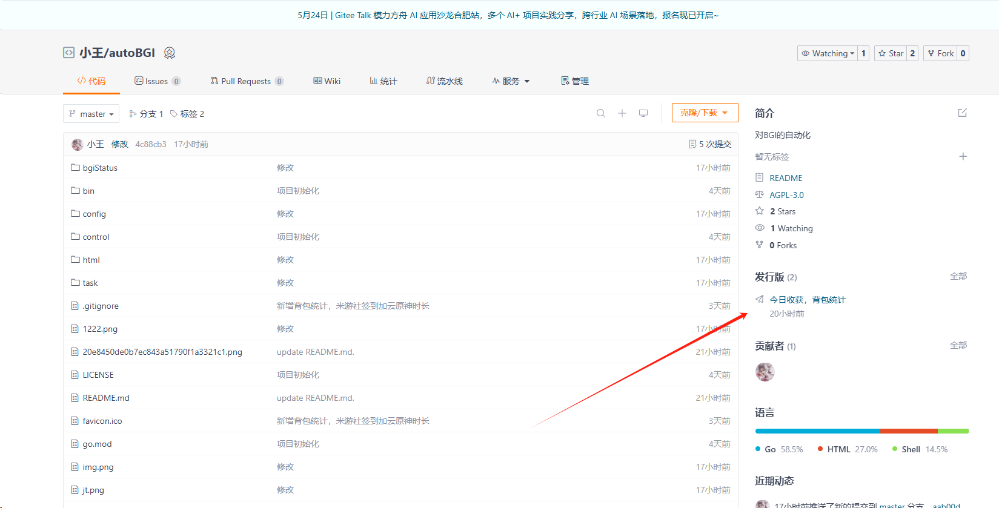
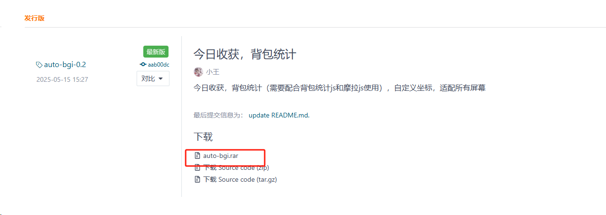
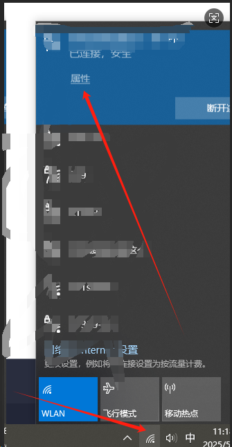

# autoBGI

# 介绍
对BGI的自动化

# 软件架构
软件架构说明

# 安装教程

## 下载下来压缩包，解压，直接双击执行，浏览器访问：ip:8082。






## 如果不知道ip地址的可以，点击网络，查看属性




## ip地址就是下面的


如果手机和电脑是同一个网络，可以在手机浏览器输入ip+8082也可以打开页面：比如：我的ip是：==192.168.1.1:8082==

## 配置说明：main.json

在运行执行，要先配置一下，main.json文件

| 字段            | 说明                                                         |
| --------------- | ------------------------------------------------------------ |
| BetterGIAddress | 你的BGI安装地址（到文件夹就行，双斜杠）                      |
| isStartTimeLong | 是否开启一条龙定时启动：true/false                           |
| isMysSignIn     | 是否米游社自动签到：true/false，需要插件，需要屏幕是1080p。  |
| OneLongHour     | 每天一条龙启动的小时，前面不能有0，比如1点启动，不能写01     |
| OneLongMinute   | 每天一条龙启动的分钟，前面不能有0，比如1分启动，不能写01     |
|                 | 设置好了OneLongHour和OneLongMinute，将会每天定时启动一条龙   |
| webhookURL      | 企业微信机器人地址                                           |
| content         | 当bgi关闭的时候，会发送通知，这个是需要发送什么              |
| configNames     | 这个是你的一条龙配置的名称，根据今天周几，来启动哪一个一条龙，必须要有7个，从星期天开始，例子："configNames": ["我的","默认配置","我的","我的","我的","我的","我的"]<br />表示星期天启动我的配置单，星期一执行默认配置类推。在一条龙的配置组名称后面加上数字，比如：挖矿-0-2-4。意思是这个配置组将会在星期天，星期二，星期四启动，其他时间不启动。每天都要执行的不用加数字，autobgi只控制加数字的，没有加数字的，原来是怎么样就是怎么样。 |
| BagStatistics   | 背包统计功能，需要配合仓库的背包统计js一起使用，将你需要关注的材料填上，英文逗号隔开（如果你导入了摩拉log的脚本，会自动加入统计，这里不需要填写摩拉） |
| post            | 修改默认端口，格式：（:8082）                                |
| backups         | 指定备份文件或者文件夹，具体格式看例子，User文件夹是默认备份的，将会打包成一个压缩包，在autobgi目录的Users文件夹下 |


例子：

```json
{
 "BetterGIAddress": "D:\\subject\\lua\\BetterGI",
 "isStartTimeLong": false,
 "isMysSignIn": false,
 "OneLongHour": 11,
 "OneLongMinute": 4,
 "webhookURL": "https://qyapi.weixin.qq.com",
 "content": "Bgi破溃了",
 "configNames": ["我的","默认配置","我的","我的","我的","我的","我的"],
 "BagStatistics": "晶核,大英雄的经验,水晶块,魔晶块,萃凝晶,苍晶螺",
 "post": ":8082",
 "backups": ["JsScript\\AutoArtifactsPro\\record.txt","AutoPathing\\矿物\\萃凝晶"]
}
```

# 功能说明：

## 一条龙启动

这个是测试坐标是否设置对的，通过这个按钮启动的一条龙，配置组将被数字规则控制。这个按钮如果可以正常启动一条龙，那么定时器大概率是没有问题，到时候自动启动。

## 关闭bgi

字面意思

## 关闭原神（启动器）

字面意思

## 查看收获前10

分析bgi的日志，统计前10个数量最多的材料，圣遗物默认进前10，哪怕0也要占一个位置

## 背包统计

依托于仓库：吉吉猫大佬的背包统计脚本，能够计算差额

## 调度器

可以直接启动配置组（45.2版本以上）

## 实时日志

可以在网页上面显示bgi的实时日志，已经适配多用户

## 查看狗粮日志

依托于仓库：mno大佬和汐大佬的狗粮pro脚本，可以一键转为折线图，分析7天的狗粮经验和摩拉。

## 备份user文件和指定文件

指定备份文件或者文件夹，具体格式看例子，User文件夹是默认备份的，将会打包成一个压缩包，在autobgi目录的Users文件夹下

# 结尾

有任何问题或者想法，可以加我qq：485595674

或者是频道@wjdsg 我
