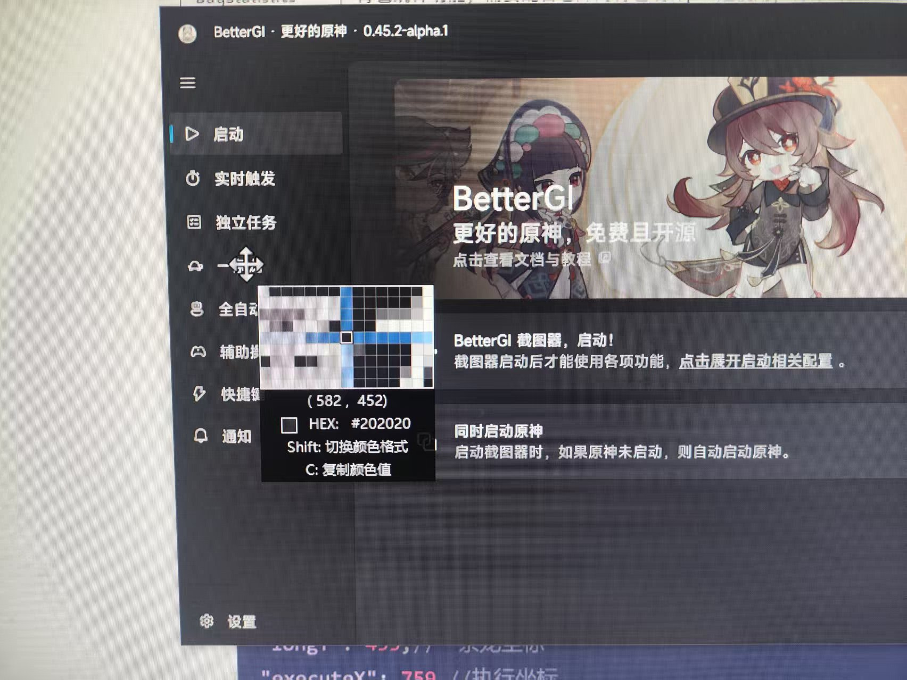

# autoBGI

# 介绍
对BGI的自动化

# 软件架构
软件架构说明

# 安装教程

## 下载下来压缩包，解压，直接双击执行，浏览器访问：ip:8082。


## 如果不知道ip地址的可以，点击网络，查看属性


## ip地址就是下面的


如果手机和电脑是同一个网络，可以在手机浏览器输入ip+8082也可以打开页面：比如：我的ip是：==192.168.1.1:8082==

## 配置说明：main.json

在运行执行，要先配置一下，main.json文件

| 字段            | 说明                                                         |
| --------------- | ------------------------------------------------------------ |
| BetterGIAddress | 你的BGI安装地址（到文件夹就行，双斜杠）                      |
| isStartTimeLong | 是否开启一条龙定时启动：true/false                           |
| isMysSignIn     | 是否米游社自动签到：true/false                               |
| OneLongHour     | 每天一条龙启动的小时，前面不能有0，比如1点启动，不能写01     |
| OneLongMinute   | 每天一条龙启动的分钟，前面不能有0，比如1分启动，不能写01     |
|                 | 设置好了OneLongHour和OneLongMinute，将会每天定时启动一条龙，点击的是bgi的默认位置，不管你bgi有没有关闭，我在启动一条龙的时候，都会关闭重新打开bgi |
| webhookURL      | 企业微信机器人地址                                           |
| content         | 当bgi关闭的时候，会发送通知，这个是需要发送什么              |
| configName      | 这个是你的一条龙配置的名称，比如默认配置，将你的配置组加入到一条龙，在配置组名称后面加上数字，比如：挖矿-0-2-4。意思是这个配置组将会在星期天，星期二，星期四启动，其他时间不启动 |
| BagStatistics   | 背包统计功能，需要配合仓库的背包统计js一起使用，将你需要关注的材料填上，英文逗号隔开（如果你导入了摩拉log的脚本，会自动加入统计，这里不需要填写摩拉） |
| longX           | 一条龙x坐标，可以使用截图工具（推荐微信）获取一条龙按钮的坐标轴 |
| longY           | 一条龙y坐标，可以使用截图工具（推荐微信）获取一条龙按钮的坐标轴 |
| executeX        | 执行x坐标，可以使用截图工具（推荐微信）获取执行按钮的坐标轴  |
| executeY        | 执行一条龙y坐标，可以使用截图工具（推荐微信）获取执行按钮的坐标轴 |
| post            | 修改默认端口，格式：（:8082）                                |
| backups         | 指定备份文件或者文件夹，具体格式看例子，User文件夹是默认备份的，将会打包成一个压缩包，在autobgi目录的Users文件夹下 |


例子：

```json1
{
 "BetterGIAddress": "D:\\subject\\lua\\BetterGI",
 "isStartTimeLong": false,
 "isMysSignIn": false,
 "OneLongHour": 11,
 "OneLongMinute": 4,
 "webhookURL": "https://qyapi.weixin.qq.com",
 "content": "Bgi破溃了",
 "configName": "我的",
 "BagStatistics": "晶核,大英雄的经验,水晶块,魔晶块,萃凝晶,苍晶螺",
 "longX": 613,
 "longY": 455,
 "executeX": 759,
 "executeY": 294,
 "post": ":8082",
 "backups": ["JsScript\\AutoArtifactsPro\\record.txt","AutoPathing\\矿物\\萃凝晶"]
}
```




## 其他功能：

### 米游社签到

正在测试阶段，里面包含了云原神免费时长获取（已经开发，每天2点打开谷歌网页，获取时长再关闭），米游社签到和米游币每日任务（浏览帖子，点赞，酒馆打卡，分享）。纯模拟点击，配合uu模拟器使用。如果需要，可以联系我获取签到插件

## 调度器

可以直接启动配置组（45.2版本以上）
