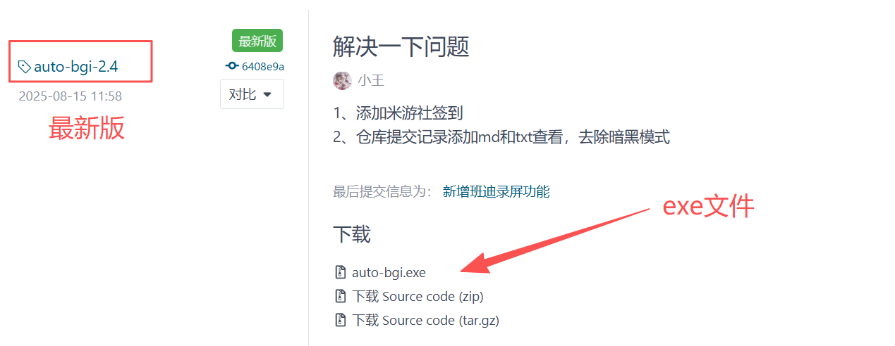
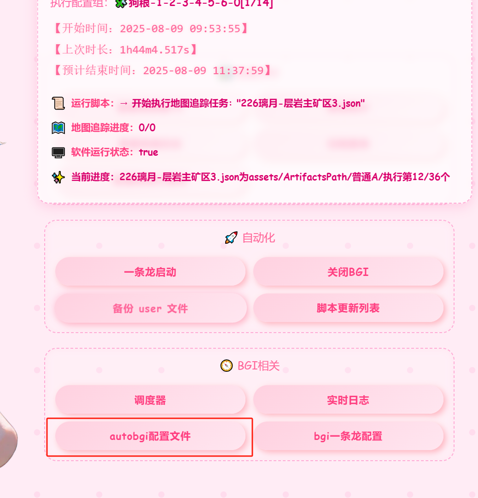

# autoBGI

# 介绍
对BGI的自动化,日志分析。

# 软件架构
go+vue

# 安装教程

一个本体：https://gitee.com/wangjian0327/auto-bgi/releases/tag/auto-bgi-%E6%9C%AC%E4%BD%93

然后是exe文件：

## 下载下来压缩包，解压，直接双击执行，浏览器访问：ip:8082。

IP地址在黑窗口里面可以看到

将其复制到浏览器打开。

## 配置设置

打开网页之后，往下滑

找到autobgi配置。

先配置BGI安装路径，保存之后，重启程序，配置其他的

配置文件main.json说明：

- OneLong：一条龙定时配置
  - isStartTimeLong：true：开启、false：关闭
  - OneLongHour：一条龙定时启动小时：0-23
  - OneLongMinute：一条龙定时启动小时：1-59
- BetterGIAddress：bgi安装路径，到exe文件夹目录就行
- content：bgi关闭发送的通知信息，随便填
- ConfigNames：一条龙配置单，七个对应七天，从星期一开始
- BagStatistics：背包统计脚本，需要关注的材料，逗号隔开
- post：默认8082，可以填你喜欢的
- MySign：米游社签到配置
  - isMysSignIn：true：开启、false：关闭
  - Time：签到时间前面是小时，后面是分钟：0,2

Control：控制配置

- IsCloseYuanShen: bgi关闭是否需要一起关闭原神加启动器【true：开启、false：关闭】
- SendWeChatImage: 是否需要一个小时发送桌面截图【true：开启、false：关闭】

LogKeywords：需要监控的关键字

[
  "未识别到突发任务",
  "OCR 识别失败",
  "此路线出现3次卡死",
  "重试一次路线或放弃此路线！",
  "检测到复苏界面",
  "存在角色被击败",
  "执行路径时出错",
  "传送点未激活或不存在"
]

OneRemote：1Remote配置

- IsMonitor：是否需要监控：【true：开启、false：关闭】
- LogFilePath：1Remote日志路径
- LogKeywords：需要监控的关键字

ScreenRecord：录屏设置

- IsRecord：true：开启、false：关闭
- ScriptGroupName：需要录屏的配置组

Notice：通知设置

- Type：通知类型【TG，Wechat】
- Wechat：企业微信机器人地址
- TGNotice：TG配置配置
  - TGToken：token
  - ChatID：会话id
  - Proxy：代理

# 功能说明：

## 一条龙启动

启动一条龙，会启动你指定的一条龙配置单名字，指定一条龙配置单里面的配置组如果带数字，将会被控制，比如：狗粮-0-1。表是狗粮这个配置组只会在星期日，星期一启动，其他时间不启动

## 关闭bgi（原神，启动器）

字面意思

## 查看收获前10

可以查看多天的，分析bgi的日志，统计前10个数量最多的材料，圣遗物默认进前10，哪怕0也要占一个位置

## 背包统计

依托于仓库：吉吉猫大佬的背包统计脚本、摩拉ocr脚本和原石统计脚本。对这三个脚本进行背包统计。清理统计只保留一天的记录。还有一个按钮，可以查询超过8000的材料

## 调度器

可以直接启动配置组（45.2版本以上）

## 实时日志

可以在网页上面显示bgi的实时日志，已经适配多用户

## 查看狗粮日志

依托于仓库：mno大佬和汐大佬的狗粮批发脚本，可以一键转为折线图，分析多天的狗粮经验和摩拉。

## 备份user文件和指定文件

指定备份文件或者文件夹，具体格式看例子，User文件夹是默认备份的，将会打包成一个压缩包，在autobgi目录的Users文件夹下，平时将会每三天备份一次

## 脚本更新列表&仓库提交记录

自动获取你所有订阅的脚本，实现管理

仓库提交记录可以查看最新的10条仓库提交记录，支持查看详情md和txt

## 配置组运行情况

可以看配置组的运行：开始时候，结束时间，运行时长，每一个子任务的收益，错误

## 归档记录

可以在配置组运行情况里面，将每一个配置组进行归档，或者一条龙结束的时候，自动将今日所有的配置组运行情况进行归档，下次执行这个配置组就可以看见预计结束时间

# 结尾

有任何问题或者想法，可以加我qq：485595674

或者是频道@wjdsg 我

远程访问autobgi，压缩包里面有一个教程文件，是一个大佬写的，具体不知道是谁，可以参考一下。

# 开发帮助

go版本：go1.23.2

node版本：22.13.1

根目录下的：build.bat是构建脚本
