# ABGI 软件使用教程

本文面向第一次使用 autoBGI（ABGI）的用户，按“安装启动 -> 登录 -> 初始化配置 -> 日常使用 -> 高级功能 -> 常见问题”的顺序说明。  
如果你只是想把 ABGI 跑起来，优先看第 1 到第 4 章。

## 1. 软件是什么

ABGI 是 BetterGI（BGI）的自动化管理与日志分析工具。它可以帮助你：

- 查看 BGI 运行状态、实时日志和桌面截图。
- 启动一条龙、配置组、脚本更新、联机上线等常用操作。
- 统计狗粮日志、配置组运行情况、旅行者札记、采集 CD 等数据。
- 配合 OBS 做录屏、回放缓存和关键时刻自动保存。
- 通过企业微信、Telegram、飞书、OneBot、钉钉等渠道发送通知。
- 根据日志关键词自动执行通知、录屏、关闭进程、启动配置组等行为。
- 提供 MCP 接口，方便 AI 客户端读取 ABGI 能力。

## 2. 准备工作

使用前请先准备好：

- 已安装并能正常运行的 BetterGI。
- ABGI 程序压缩包。
- autobgi.exe
- 将exe放进解压的压缩包里面
- Windows 运行权限。第一次运行建议右键使用管理员权限。
- 如果要使用录屏功能，提前安装 OBS，并开启 OBS WebSocket。
- 如果要使用通知功能，准备对应平台的机器人 Webhook、Token 或 App 信息。

## 3. 下载、解压与启动

### 3.1 下载程序

访问发布页下载安装包：

[Gitee Releases](https://gitee.com/wangjian0327/auto-bgi/releases)

下载后解压到一个固定目录，例如：

```text
D:\auto-bgi
```

建议不要放在需要额外权限的系统目录中，也不要频繁移动程序目录。

### 3.2 修改登录信息

在 ABGI 根目录中找到配置文件，按实际需要修改：

- 登录账号
- 登录密码
- 页面标题或业主名称
- 端口号，默认通常为 `8082`

如果你修改了端口，访问地址也要同步改变，例如：

```text
http://电脑IP:端口
```

### 3.3 启动 ABGI

双击运行 ABGI 程序。如果网页打不开，请先确认：

- ABGI 程序窗口或后台进程正在运行。
- 防火墙已放行端口。
- 访问地址中的 IP 和端口正确。

本机访问通常是：

```text
http://127.0.0.1:8082
```

局域网访问通常是：

```text
http://你的电脑IP:8082
```

## 4. 登录与首页

打开网页后会进入登录页。这里的登录账号、密码对应你在配置文件里设置的账号和密码。

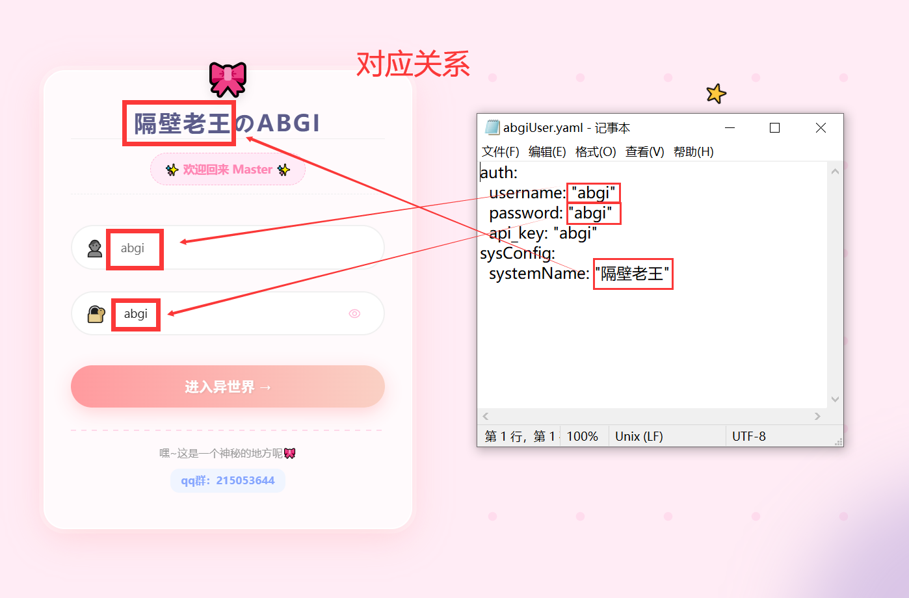

操作步骤：

1. 在“用户名”里输入配置文件中的账号。
2. 在“密码”里输入配置文件中的密码。
3. 点击登录按钮进入首页。

登录成功后会进入 BGI 控制台。首页顶部显示运行状态监控，包括：

- 当前配置组
- 运行状态
- 当前路线
- JS 进度
- 预计结束时间

首页功能按区域分为：

- 常用菜单
- 实时监测
- 数据分析
- 自动化控制
- 提瓦特指挥所

首页上的功能都从这些菜单进入。第一次配置时，先在首页找到“ABGI设置”。

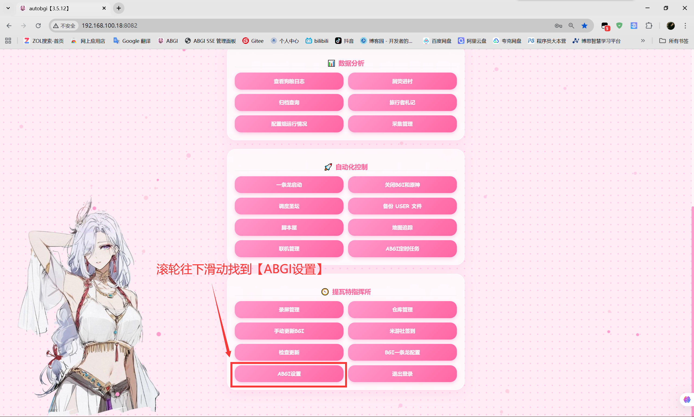

右键首页菜单按钮可以把常用功能置顶到“常用菜单”。如果你每天只用几个入口，建议把“实时日志”“一条龙启动”“调度圣坛”“ABGI设置”“录屏管理”置顶。

## 5. 首次初始化配置

首次使用时，先进入：

```text
提瓦特指挥所 -> ABGI设置
```

进入设置页后，先配置 BetterGI 的本地路径。路径配置正确后，ABGI 才能启动一条龙、配置组、备份 User 文件和读取 BGI 日志。

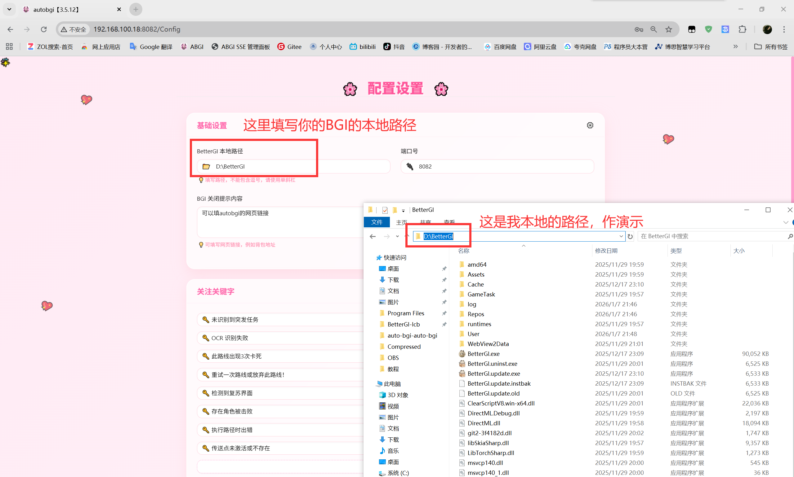

保存配置后，页面会提示保存结果。确认保存成功后再回到首页使用其他功能。

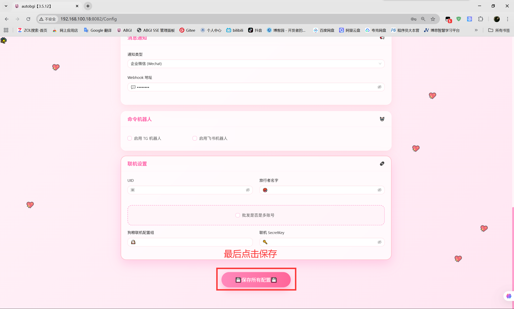

### 5.1 基础设置

重点填写：

- BetterGI 本地路径  
  示例：`D:\subject\lua\BetterGI`

- 端口号  
  默认可使用 `8082`，如果端口冲突再修改。

- BGI 关闭提示内容  
  可填写关闭 BGI 后要发送到通知渠道的文字，也可以填网页链接。

注意：BetterGI 路径不要包含逗号，路径按页面提示使用单斜杠或普通 Windows 路径。

### 5.2 功能开关

常用开关说明：

| 开关 | 作用 |
| --- | --- |
| 自动更新 JS | 一条龙前自动更新脚本 |
| OBS 重放缓冲 | 配合 OBS 回放缓存使用 |
| 每小时发截图 | 定时把桌面截图发送到通知渠道 |
| 开机自启动 | Windows 启动后自动启动 ABGI |
| 实时屏幕 | 开启屏幕共享能力，功耗较高 |
| BGI关闭时关闭原神 | 关闭 BGI 时同步关闭原神 |
| 是否开启血条检测 | 开启红血检测，可设置触发吃药次数 |
| 是否开启 MCP | 开启给 AI 客户端使用的 MCP 接口 |
| 启用 Maa 功能 | 首页显示 Maa 控制台 |
| Q技能检测 | 需要额外放置 `onnxruntime.dll` 到 `bin` 目录 |

### 5.3 开机自启动

入口：

```text
提瓦特指挥所 -> ABGI设置 -> 功能开关 -> 开机自启动
```

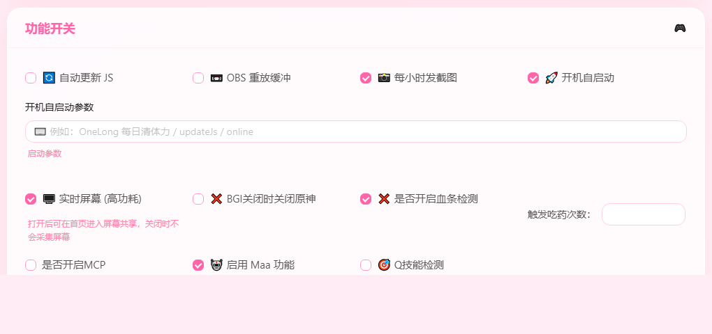

操作步骤：

1. 勾选“开机自启动”。
2. 如果只是开机后启动 ABGI，下面的“开机自启动参数”可以留空。
3. 如果希望开机后自动执行某个动作，可以填写启动参数。
4. 点击页面底部“保存所有配置”。
5. 重启电脑后确认 ABGI 是否自动启动。

常用启动参数：

| 参数 | 效果 |
| --- | --- |
| 留空 | 只启动 ABGI |
| `OneLong 一条龙名字` | 启动 ABGI 后直接运行指定一条龙 |
| `updateJs` | 启动 ABGI 后自动更新脚本 |
| `online` | 启动 ABGI 后进入联机调试上线 |

说明：

- 内置开关会写入当前 Windows 用户的开机启动项。
- 如果 ABGI 所在目录移动了，需要重新保存一次开机自启动。
- 如果你的 ABGI 必须管理员权限才能正常控制 BGI，建议右键 `auto-bgi.exe` -> 属性 -> 兼容性 -> 勾选“以管理员身份运行此程序”。
- 如果开机自启动被安全软件拦截，或需要延迟启动，可以改用 Windows“任务计划程序”，触发器选择“登录时”，操作选择 `auto-bgi.exe`，并勾选“以最高权限运行”。

### 5.4 录屏设置

如果你要使用 OBS 录制或回放，填写：

- OBS 地址，例如 `ws://127.0.0.1:4455`
- OBS WebSocket 密码
- OBS 保存文件地址

OBS 里需要开启 WebSocket 服务。更完整的图文教程见：

[READMEOBS&&ABGI.md](./READMEOBS&&ABGI.md)

### 5.5 消息通知

ABGI 支持以下通知渠道：

| 通知类型 | 需要填写 |
| --- | --- |
| 企业微信 | Webhook 地址 |
| Telegram | Bot Token、Chat ID，可选代理 |
| 飞书 | Webhook URL、App ID、App Secret |
| OneBot | API Base、Token、QQ号、群号、Secret |
| 钉钉 | Webhook URL，可选加签 Secret |

页面提示“敏感信息不会在页面中回显”：已保存的密码、Token、Webhook 不会完整显示。只有需要修改时才重新填写，不修改可以留空保存。

### 5.6 命令机器人

如果开启 TG 或飞书机器人，可以通过机器人远程发送指令。常用指令包括：

| 指令 | 作用 |
| --- | --- |
| 启动一条龙xxx | 启动指定一条龙 |
| 启动配置组xxx yyyy | 启动多个配置组，空格分隔 |
| 批量更新脚本 | 更新全部脚本 |
| 联机上线 | 狗粮联机上线 |
| 联机下线 | 狗粮联机下线 |
| 情况 | 查看当前运行状态 |
| 截图 | 发送桌面截图 |
| 开始录屏 | 开始 OBS 录制 |
| 停止录屏 | 停止 OBS 录制 |
| 关闭原神 | 关闭原神 |
| 关闭bgi | 关闭 BGI |
| 电脑关机 | 60 秒后关机 |
| 取消关机 | 取消关机计划 |

### 5.7 保存配置

配置完成后点击页面底部的“保存所有配置”。保存成功后一般会返回首页。

## 6. 日常使用流程

### 6.1 查看运行状态

进入首页即可查看运行状态。如果想看更详细的实时输出：

```text
实时监测 -> 实时日志
```

如果想查 ABGI 自身日志：

```text
实时监测 -> ABGI日志查询
```

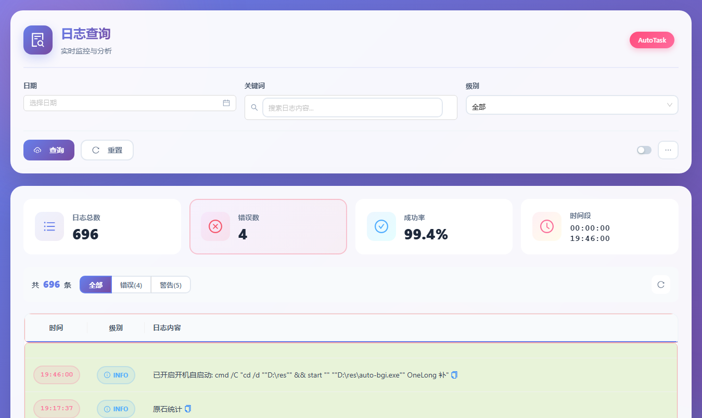

ABGI 日志查询支持搜索、自动刷新、导出、复制和清空。

### 6.2 查看桌面或发送截图

入口：

```text
实时监测 -> 查看桌面
```

打开后可以查看运行 ABGI 的电脑桌面截图，支持自动刷新、暂停刷新、放大缩小。

入口：

```text
实时监测 -> 发送截图
```

点击后会把当前桌面截图发送到你配置的通知渠道。发送前请确认通知配置正确。

### 6.3 启动一条龙

入口：

```text
自动化控制 -> 一条龙启动
```

操作步骤：

1. 点击“一条龙启动”。
2. 在弹窗中选择要启动的一条龙配置。
3. 确认启动。

如果存在未完成任务，页面会提示是否继续。一般日常运行优先使用这个入口。

### 6.4 启动配置组

入口：

```text
自动化控制 -> 调度圣坛
```

这里可以选择并启动 BGI 配置组。多个配置组可以按页面提示选择或输入。

### 6.5 更新脚本

入口：

```text
自动化控制 -> 脚本屋
```

脚本屋用于查看已订阅脚本、单个更新、批量更新。

新版本也提供：

```text
自动化控制 -> 新脚本屋（测试中）
```

新脚本屋通过仓库压缩包安装或更新脚本，不依赖本地 git 仓库。

### 6.6 关闭 BGI 和原神

入口：

```text
自动化控制 -> 关闭BGI和原神
```

这是立即关闭类操作，点击前请确认当前任务可以中断。

### 6.7 备份 USER 文件

入口：

```text
自动化控制 -> 备份 USER 文件
```

会把 BetterGI 的 `User` 文件夹打包备份到 ABGI 目录下的 `Users` 文件夹。更新或大改配置前建议先备份。

## 7. 数据分析功能

### 7.1 查看狗粮日志

入口：

```text
数据分析 -> 查看狗粮日志
```

该功能需要配合 BGI 的 `AAA狗粮批发` JS 脚本。它会统计狗粮收益、摩拉、狗粮经验等数据，联机收益也会自动相加，并支持查看折线图。

### 7.2 屑荧进村

入口：

```text
数据分析 -> 屑荧进村
```

用于统计 BGI 交换或拾取数量超过 10 的材料。程序带相似度判断，OCR 轻微识别错误时也能尽量匹配真实材料名。

### 7.3 归档查询

入口：

```text
数据分析 -> 归档查询
```

归档用于记录配置组历史运行时间。下次运行相同配置组时，首页可以显示预计结束时间。

说明：

- 配置组运行时间少于 30 秒时，不会自动归档。
- 可以在“配置组运行情况”中手动归档。
- 一条龙结束时可自动归档今日配置组运行情况。

### 7.4 旅行者札记

入口：

```text
数据分析 -> 旅行者札记
```

可查看材料、原石、摩拉、吃药统计等内容。使用前需要在 BGI 设置中填写米游社 Cookie，且 Cookie 不能有空格。

常用操作：

- 添加关注材料，例如薄荷。
- 查看超过 8000 的材料。
- 加入黑名单或删除黑名单。
- 查看材料趋势。

如果要自动记录背包，请在 ABGI 定时任务中添加“原神背包记录”任务。

### 7.5 配置组运行情况

入口：

```text
数据分析 -> 配置组运行情况
```

用于查看配置组执行结果、耗时、失败情况和详情日志。适合排查哪个配置组慢、失败多、需要调整。

### 7.6 采集管理

入口：

```text
数据分析 -> 采集管理
```

配合 BetterGI 的 JS 脚本“采集 CD 管理”使用。脚本运行后，ABGI 会汇总采集路线、材料拾取记录和路线 CD，适合多账号查看哪些路线已经可以重新采集。

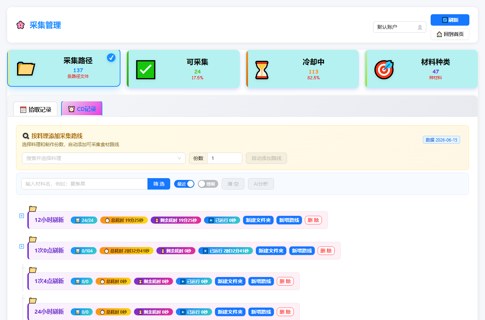

页面上方会显示当前账号的采集统计：

| 区域 | 作用 |
| --- | --- |
| 账号选择 | 多用户使用时，先在右上角选择要查看的账号。 |
| 采集路径 | 当前账号已经记录的采集路线数量。 |
| 可采集 | 已过 CD、可以重新运行的路线数量。 |
| 冷却中 | 还没有到刷新时间的路线数量。 |
| 材料种类 | 当前记录中涉及到的采集材料类型。 |

常用操作：

1. 进入“CD记录”后，优先看上方四个统计卡片，确认整体可采集数量。
2. 在路线列表中查看每个文件夹或路线的“总耗时”“剩余耗时”“已运行时间”等信息。
3. 想按材料找路线时，在材料筛选框输入材料名，例如“夏槲果”，再点击“筛选”。
4. “最近/历史”用于切换按最近记录还是历史记录匹配材料；“精确/模糊”用于控制材料名匹配方式。
5. 需要补充路线时，可以使用“新建文件夹”“新增路线”。删除路线前先确认该路线不再使用。

“按料理添加采集路线”适合缺食材时使用：选择料理和制作份数后，系统会根据料理需要的材料自动匹配可用采集路线。这个操作会修改路线清单，建议先确认当前账号选择正确。

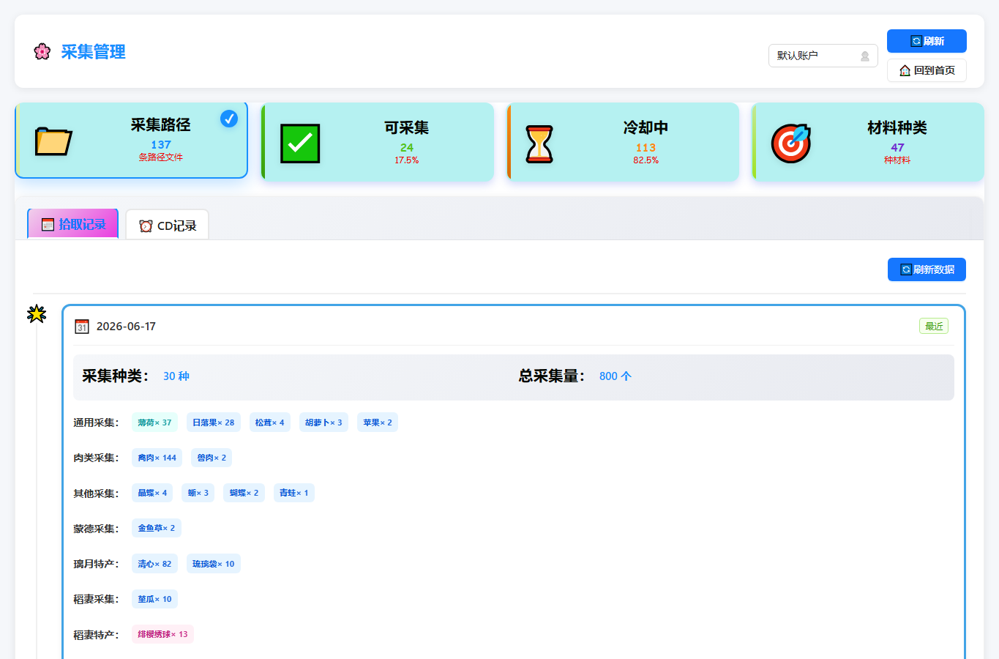

“拾取记录”用于查看脚本记录到的每日采集结果：

1. 点击“拾取记录”标签页。
2. 按日期查看当天采集了哪些材料、每种材料数量是多少。
3. 如果刚运行完 BetterGI 采集脚本，点击“刷新数据”更新页面。
4. 如果页面没有数据，先检查 BetterGI 的采集 CD 管理脚本是否已经运行，以及 ABGI 设置中的 BetterGI 路径是否正确。

## 8. 自动化控制

### 8.1 BGI 快捷键

入口：

```text
自动化控制 -> BGI快捷键
```

用于查询或触发 BGI 快捷键。适合需要网页远程点按 BGI 操作时使用。

### 8.2 地图追踪

入口：

```text
自动化控制 -> 地图追踪
```

选择配置组和地图追踪文件夹后，ABGI 会把地图追踪加入到配置组中。

说明：

- 如果配置组已有相关地图追踪，会先清理再加入新的地图追踪。
- 如果配置组没有相关地图追踪，会直接追加进去。
- 部分茶包版暂不支持。

### 8.3 联机管理

入口：

```text
自动化控制 -> 联机管理
```

用于狗粮联机上线、调试上线、下线、模板图片生成、专属匹配房间、公共匹配房间等。

使用前建议先在：

```text
提瓦特指挥所 -> ABGI设置 -> 联机设置
```

填写 UID、旅行者名字、狗粮联机配置组、SecretKey 等信息。

### 8.4 1Remote 管理

入口：

```text
自动化控制 -> 1Remote管理
```

用于本地多用户远程监控和会话管理。使用前先在 ABGI 设置中填写 1Remote 安装路径。

### 8.5 角色培养计划

入口：

```text
自动化控制 -> 角色培养计划
```

用于按角色养成目标管理材料与配置组启动。适合把角色材料路线和自动运行计划结合起来。

### 8.6 Maa 控制台

Maa 控制台用于调用 MaaFramework 执行你放在 `MaaResources` 里的 Pipeline。它可以对桌面窗口或 ADB 设备做识别、点击、滑动、按键、OCR 等自动化动作。

#### 8.6.1 群里两个压缩包放哪里

QQ群里的 MAA 相关压缩包一般分为两类：

- `MaaResources.zip`：资源包，里面通常有 `pipeline`、`image`、`model`。
- `MaaFramework.zip`：运行库，里面通常有 `bin`，并包含 `MaaFramework.dll`、`MaaToolkit.dll`、`MaaWin32ControlUnit.dll` 等文件。

最终目录结构必须是这样：


文字版目录：

```text
ABGI根目录
├─ auto-bgi.exe
├─ main.json
├─ MaaResources
│  ├─ pipeline
│  ├─ image
│  └─ model
│     └─ ocr
├─ MaaUser
│  ├─ config
│  └─ debug
└─ lib
   └─ MaaFramework
      └─ bin
         ├─ MaaFramework.dll
         ├─ MaaToolkit.dll
         ├─ MaaWin32ControlUnit.dll
         └─ ...
```

放置方法：

1. 把 `MaaResources.zip` 解压到 ABGI 根目录，最终得到 `ABGI根目录\MaaResources`。
2. 把 `MaaFramework.zip` 解压到 `ABGI根目录\lib` 目录下，最终得到 `ABGI根目录\lib\MaaFramework\bin`。
3. 如果没有 `MaaUser`，ABGI 会自动创建；也可以手动建一个 `MaaUser` 文件夹。
4. 解压后重启 ABGI，或者进入 Maa 控制台后点击“释放运行时”，再重新初始化。

注意：不要多套一层目录。下面这种结构是错误的：

```text
ABGI根目录\lib\MaaFramework\MaaFramework\bin
ABGI根目录\MaaResources\MaaResources\pipeline
```

正确判断方式：

- `lib\MaaFramework\bin` 里面能直接看到 `MaaFramework.dll`。
- `MaaResources\pipeline` 里面能直接看到 `.json` Pipeline 文件。
- `MaaResources\model\ocr` 里面有 OCR 模型目录，例如 `ppocr_v6`。

补充：`Q技能检测` 用到的 `onnxruntime.dll` 不是 MaaFramework 的压缩包。它按页面提示放到：

```text
ABGI根目录\bin\onnxruntime.dll
```

#### 8.6.2 启用 Maa 功能

Maa 控制台入口是否显示取决于：

```text
ABGI设置 -> 功能开关 -> 启用 Maa 功能
```

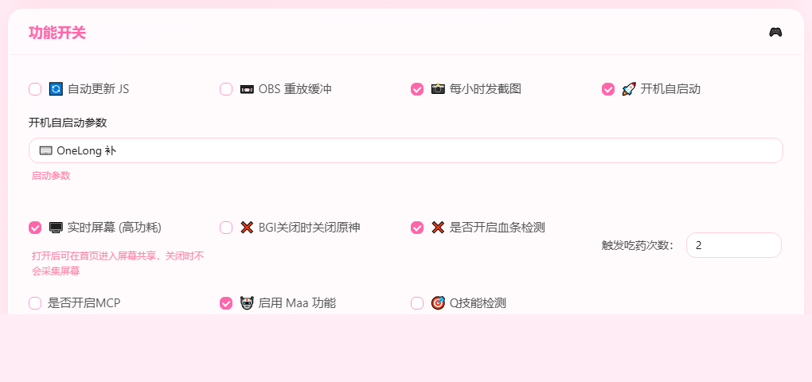

操作步骤：

1. 进入 `提瓦特指挥所 -> ABGI设置`。
2. 找到“功能开关”。
3. 勾选“启用 Maa 功能”。
4. 点击“保存所有配置”。
5. 回到首页，在“自动化控制”里进入 `Maa控制台`。

#### 8.6.3 Maa 控制台页面

入口：

```text
自动化控制 -> Maa控制台
```

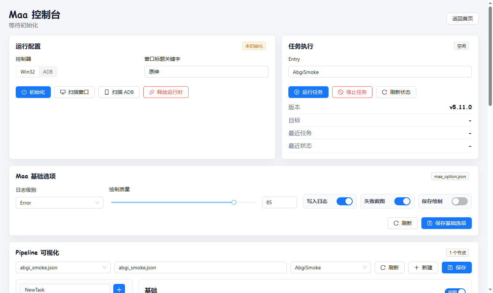

页面主要分为四块：

| 区域 | 作用 |
| --- | --- |
| 运行配置 | 选择 Win32 或 ADB 控制器，设置目标窗口或设备 |
| 任务执行 | 选择 Entry，初始化后运行或停止任务 |
| Maa 基础选项 | 设置日志级别、绘制质量、失败截图、保存绘制等 |
| Pipeline 可视化 | 查看、编辑、新建和保存 Pipeline 节点 |

#### 8.6.4 Win32 桌面窗口模式

适合控制电脑上的原神窗口。

操作步骤：

1. 控制器选择 `Win32`。
2. 窗口标题关键字填写 `原神`，或填写你的目标窗口标题关键字。
3. 点击“扫描窗口”，确认列表里能看到目标窗口。
4. 如果扫描到了窗口，可以点列表中的窗口项，自动填入窗口标题。
5. 点击“初始化”。
6. 初始化成功后，在 Entry 中选择要运行的入口节点。
7. 点击“运行任务”。

如果提示找不到窗口，先检查：

- 原神窗口是否已经打开。
- 窗口是否最小化。
- 窗口标题关键字是否写错。
- 是否需要手动切到原神窗口后重新初始化。

#### 8.6.5 ADB 设备模式

适合控制模拟器或手机。

操作步骤：

1. 控制器选择 `ADB`。
2. 填写 `ADB 路径`，例如模拟器自带的 `adb.exe`。
3. 填写 `ADB 地址`，例如 `127.0.0.1:5555`。
4. 如页面需要，填写 `Agent 路径`。
5. 点击“扫描 ADB”，确认设备能被识别。
6. 点击设备项后再点击“初始化”。
7. 选择 Entry 并点击“运行任务”。

如果扫描不到设备，先在命令行确认：

```bash
adb devices
```

#### 8.6.6 运行任务

运行前需要先完成初始化。

常用流程：

1. 在 `Pipeline 可视化` 中选择 Pipeline 文件，例如 `abgi_smoke.json`。
2. 在 Entry 下拉框中选择入口节点，例如 `AbgiSmoke` 或 `Startup`。
3. 点击“运行任务”。
4. 任务运行中可以点击“停止任务”。
5. 运行结束后查看“最近任务”“最近状态”和运行结果。

#### 8.6.7 Pipeline、图片和 OCR 模型放置规则

Maa 控制台读取这些目录：

| 内容 | 放置目录 |
| --- | --- |
| Pipeline JSON | `MaaResources\pipeline` |
| 模板图片 | `MaaResources\image` |
| OCR 模型 | `MaaResources\model\ocr` |
| Maa 用户配置 | `MaaUser\config` |
| 失败截图/调试文件 | `MaaUser\debug` |

在 Pipeline 可视化里：

- “选择 Pipeline”读取 `MaaResources\pipeline`。
- “图片资源”读取 `MaaResources\image`。
- “模型目录”读取 `MaaResources\model\ocr`。
- 保存 Pipeline 会写回对应的 Pipeline JSON。

建议先复制一份已有 Pipeline 再修改，避免直接改坏可用配置。

#### 8.6.8 常见问题

| 问题 | 处理方法 |
| --- | --- |
| 首页没有 Maa 控制台 | 到 ABGI 设置里勾选“启用 Maa 功能”并保存 |
| 初始化提示 MaaFramework 加载失败 | 检查 `lib\MaaFramework\bin` 是否存在，且里面有 `MaaFramework.dll` |
| 初始化提示 Maa 资源加载失败 | 检查 `MaaResources` 是否放在 ABGI 根目录，里面是否有 `pipeline`、`image`、`model` |
| 找不到原神窗口 | 确认原神已打开、未最小化，窗口标题关键字可改成更准确的文字 |
| 运行任务提示 Maa 尚未初始化 | 先点“初始化”，成功后再运行任务 |
| OCR 不生效 | 检查 `MaaResources\model\ocr` 下是否有模型目录，并在节点里选择对应模型 |

## 9. ABGI 定时任务

入口：

```text
自动化控制 -> ABGI定时任务
```

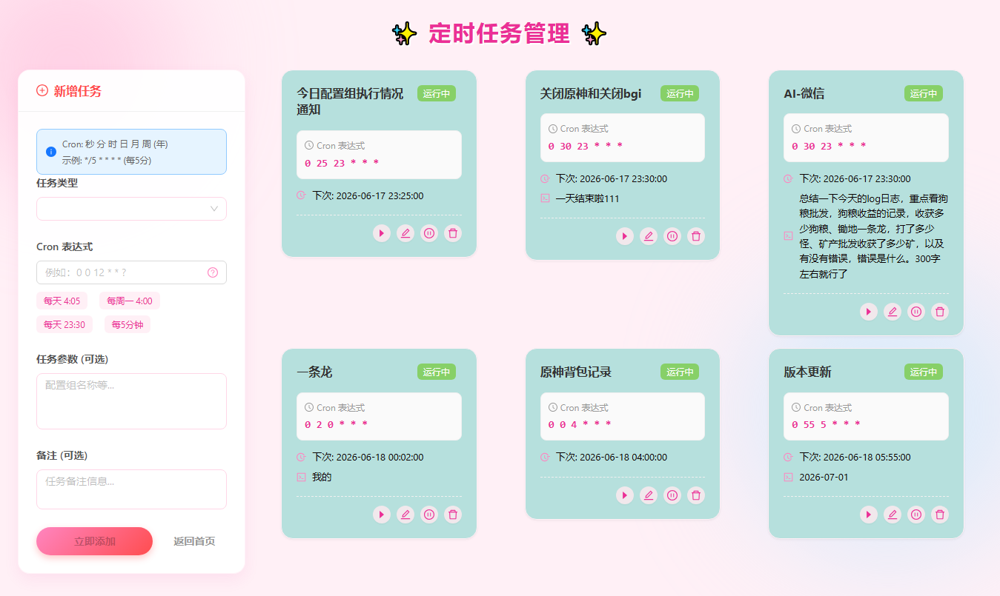

定时任务页面左侧是新增或编辑表单，右侧是任务列表。

### 9.1 新增任务

1. 选择任务类型。
2. 填写 Cron 表达式。
3. 按任务需要填写任务参数。
4. 填写备注，方便以后识别。
5. 点击“立即添加”。

Cron 表达式格式：

```text
秒 分 时 日 月 周
```

页面内置常用示例：

| 时间 | Cron |
| --- | --- |
| 每天 4:05 | `0 5 4 * * *` |
| 每周一 4:00 | `0 0 4 ? * MON` |
| 每天 23:30 | `0 30 23 * * *` |
| 每 5 分钟 | `0 */5 * * * ?` |

### 9.2 常用任务类型和参数

| 任务类型 | 参数写法 |
| --- | --- |
| 一条龙 | 一条龙名称 |
| 配置组 | 配置组名称，多个用空格隔开 |
| 计划表(茶包) | 计划表名称或页面要求的参数 |
| 米游社签到 | 通常留空 |
| 原神背包记录 | 通常留空，需先配置米游社 Cookie |
| 关闭原神和关闭bgi | 通常留空 |
| 备份user | 通常留空 |
| 定时关机 | 通常留空，触发后 60 秒关机 |
| 定时重启 | 通常留空，触发后 60 秒重启 |
| 狗粮联机上线 | 通常留空 |
| 狗粮联机调试上线 | 通常留空 |
| 联机下线 | 通常留空 |
| 联机更换房间 | `原房间-新房间` |
| 电脑静音 | 通常留空 |
| 脚本自动更新 | 通常留空 |
| 指定脚本更新 | 脚本文件夹名，多个用空格隔开 |
| 启动bat脚本 | bat 文件完整路径 |
| 今日配置组执行情况通知 | 通常留空 |
| 开始obs录制 | 通常留空 |
| 结束obs录制 | 通常留空 |
| 删除obs视频 | 保留天数，填写数字 |
| 开启obs回放缓存 | 通常留空 |
| 关闭obs回放缓存 | 通常留空 |
| 关闭obs | 通常留空 |
| 一条龙全部开启/关闭 | `一条龙名称-开启` 或 `一条龙名称-关闭` |
| 启动1Remote多用户 | 用户名，多个用 `-` 分隔 |
| 注销1Remote多用户 | 用户名，多个用 `-` 分隔 |
| AI-微信 / AI-TG / AI-飞书 / AI-OneBot | 发送给 AI 的提示词 |
| 版本更新 | 按页面或版本更新任务要求填写 |
| 键鼠操作 | 见下方格式 |

键鼠操作参数格式：

```text
Mouse-x坐标-y坐标-左键还是右键-延迟毫秒*Keyboard-按键名称-延迟毫秒
```

示例：

```text
Mouse-1005-528-右键-500*Keyboard-lwdsg-300
```

### 9.3 管理任务

任务卡片支持：

- 立即运行一次
- 编辑
- 暂停
- 恢复
- 删除

删除后需要重新创建才能恢复。

## 10. 日志行为编排

入口：

```text
自动化控制 -> 日志行为编排
```

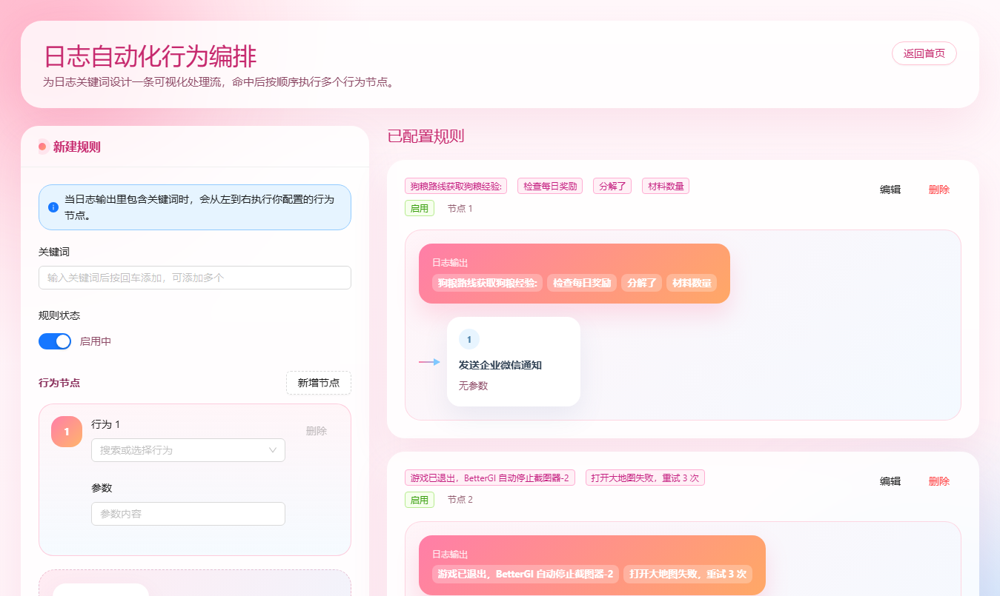

这个功能用于“日志里出现某些关键词时，自动按顺序执行动作”。

### 10.1 创建规则

1. 在“关键词”中输入一个或多个关键词，按回车添加。
2. 确认规则状态为“启用中”。
3. 添加行为节点。
4. 为每个节点选择行为类型并填写参数。
5. 查看页面下方预览。
6. 点击“创建规则”。

### 10.2 常用行为

| 行为 | 参数 |
| --- | --- |
| 发送默认通知 | 留空则发送日志原文 |
| 发送企业微信/TG/QQ/QQ群通知 | 留空则发送日志原文 |
| 关闭 BGI 和原神 | 留空 |
| 重启 ABGI | 留空 |
| 重启多用户 | 用户名，多个用 `-` 分隔 |
| 启动 obs 回放缓存 | 留空 |
| 关闭 obs 回放缓存 | 留空 |
| obs 保存回放缓存 | 留空 |
| OBS 开始录制 | 留空 |
| OBS 停止录制 | 留空 |
| 启动配置组 | 配置组名称，多个用空格隔开 |
| 启动一条龙 | 一条龙名称 |
| 开启/关闭红血检测 | 留空 |
| 鼠标操作 | `x-y-左/右-单击` 等页面提示格式 |
| 键盘操作 | 按键名称，例如 `F` |
| 执行 bat 脚本 | bat 完整路径 |

建议先从“发送通知”这类低风险动作开始测试，确认关键词命中正常后，再配置关闭进程、键鼠操作、启动任务等高风险动作。

## 11. OBS 录屏管理

入口：

```text
提瓦特指挥所 -> 录屏管理
```

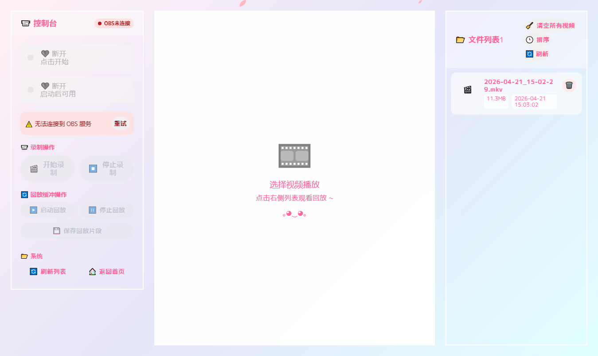

可操作：

- 查看录制状态
- 开始录制
- 停止录制
- 开启回放缓存
- 关闭回放缓存
- 保存回放缓存
- 查看视频文件列表
- 删除视频
- 清空视频

使用条件：

1. 已安装 OBS。
2. OBS 已开启 WebSocket。
3. ABGI 设置里 OBS 地址和密码正确。
4. 如果要保存回放，OBS 内需要开启回放缓存功能。

## 12. 提瓦特指挥所

### 12.1 AI 助手

入口：

```text
提瓦特指挥所 -> AI助手
```

使用前先在 ABGI 设置中开启 AI 助手，并填写模型名称、Base URL 和 API Key。

### 12.2 仓库管理

入口：

```text
提瓦特指挥所 -> 仓库管理
```

用于查看仓库文件，支持查看 `md` 和 `txt` 文件详情。

### 12.3 手动更新 BGI

入口：

```text
提瓦特指挥所 -> 手动更新BGI
```

上传 BGI 压缩包。要求压缩包解压后直接是 BGI 文件夹结构。更新前 ABGI 会自动备份 `User` 和 `log` 文件夹。

### 12.4 米游社签到

入口：

```text
提瓦特指挥所 -> 米游社签到
```

使用前需要按群内教程准备签到压缩包和 `stoken-cookie`。如果要把签到结果推送出去，还需要配置通知渠道，并在 ABGI 设置的消息通知中点击“设置为米游社签到推送”。

### 12.5 米游社工具

入口：

```text
提瓦特指挥所 -> 米游社工具
```

用于二维码登录、读取 Cookie、刷新角色信息等米游社相关能力。

### 12.6 BGI 一条龙配置

入口：

```text
提瓦特指挥所 -> BGI一条龙配置
```

支持管理 BGI 一条龙里的配置组：

- 公版 BGI：打开或关闭配置组。
- 茶包版 BGI：排序、打开、关闭配置组。

建议尽量在 BGI 关闭时修改配置。

### 12.7 检查更新

入口：

```text
提瓦特指挥所 -> 检查更新
```

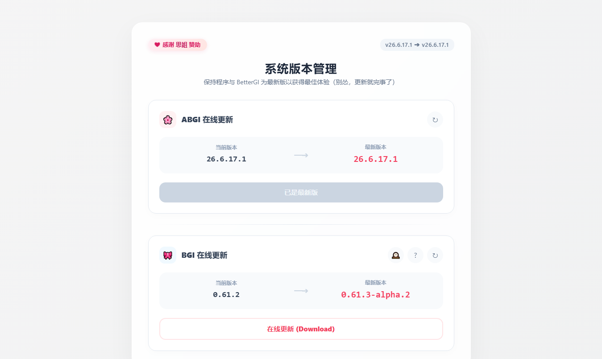

可检查并更新 ABGI 和 BetterGI。更新成功后可能会自动跳转到登录页或需要等待程序重启。

### 12.8 退出登录

入口：

```text
提瓦特指挥所 -> 退出登录
```

点击后会清除当前网页登录状态并回到登录页。

## 13. MCP 接口

如果在 ABGI 设置中开启 MCP，可以在 AI 客户端中配置：

```json
{
  "transport": "sse",
  "url": "http://ip:端口/mcp/sse",
  "headers": {
    "apiKey": "abgi"
  },
  "timeout": 5,
  "sse_read_timeout": 300
}
```

把 `ip:端口` 替换为你的 ABGI 访问地址。

## 14. 命令行启动

在 ABGI 程序目录下可以使用命令行参数。

启动 ABGI 后直接运行一条龙：

```bash
auto-bgi.exe OneLong 一条龙名字
```

启动 ABGI 后直接更新脚本：

```bash
auto-bgi.exe updateJs
```

启动 ABGI 后进入联机调试上线：

```bash
auto-bgi.exe online
```

如果开启了开机自启动，也可以在 ABGI 设置中填写这些启动参数。

## 15. 常见问题

### 15.1 启动后打不开网页

按顺序检查：

1. ABGI 程序是否正在运行。
2. 端口是否正确，默认通常是 `8082`。
3. 防火墙是否放行该端口。
4. 是否用错 IP。本机用 `127.0.0.1`，局域网设备用运行 ABGI 电脑的局域网 IP。
5. 如果改过端口，确认配置文件里的端口格式正确。

### 15.2 登录失败

检查：

- 配置文件中的账号密码是否正确。
- 是否改完配置后重启了 ABGI。
- 浏览器是否缓存了旧登录状态。可以退出登录或清除站点缓存后再试。

### 15.3 保存配置后功能不生效

检查：

- 是否点击了“保存所有配置”。
- 涉及端口、启动项、OBS、通知等配置时，是否需要重启 ABGI。
- 敏感字段不回显是正常现象，不代表没有保存。

### 15.4 备份 USER 文件失败

检查：

- BetterGI 本地路径是否正确。
- ABGI 是否有权限读取 BetterGI 的 `User` 目录。
- 目标备份目录是否可写。

### 15.5 OBS 无法录制或保存回放

检查：

- OBS 是否已经启动。
- OBS WebSocket 是否开启。
- 地址和密码是否填写正确。
- OBS 是否开启了回放缓存。
- OBS 保存路径是否可写。

### 15.6 通知发不出去

检查：

- 通知类型是否选对。
- Webhook、Token、Chat ID、App ID、App Secret 是否正确。
- TG 是否需要代理。
- OneBot 服务是否启动，API Base 是否能访问。
- 钉钉机器人是否配置了正确的加签 Secret。

### 15.7 定时任务没有执行

检查：

- Cron 表达式是否正确。
- 任务是否处于“运行中”，不是“已暂停”。
- 任务参数是否符合对应任务格式。
- ABGI 是否一直保持运行。
- ABGI 日志中是否有任务报错。

## 16. 推荐新手配置顺序

第一次配置建议按这个顺序来：

1. 启动 ABGI 并登录。
2. 进入 ABGI 设置，填写 BetterGI 本地路径。
3. 保存配置并返回首页。
4. 用“实时日志”确认日志能读取。
5. 用“一条龙启动”或“调度圣坛”测试一次基础自动化。
6. 配置通知渠道。
7. 测试“发送截图”。
8. 如果需要录屏，再配置 OBS。
9. 最后再配置定时任务、日志行为编排、联机管理等高级功能。

这样排查成本最低：先确保 ABGI 能控制 BGI，再逐步加通知、录屏和自动化。
