# autoBGI

## 📌 目录
- [介绍](#介绍)
- [软件架构](#软件架构)
- [安装教程](#安装教程)
- [功能说明](#功能说明)
- [常见问题](#常见问题)
- [命令](#命令)
- [开发帮助](#开发帮助)
- [联系方式](#联系方式)

---

## 介绍
**autoBGI** (简称ABGI)是一个对BGI(全称BetterGI) 进行自动化管理与日志分析工具。它整合了自动执行任务、背包统计、OBS 录屏/回放控制、AI 对话支持与飞书/TG 机器人通知等多种功能，目标是为 BGI 用户提供一体化的自动化运维与日志可视化工具。

界面基于 **Vue**，后端使用 **Go** 实现。

---

## 软件架构
- **后端**：Go 语言（go1.23.2）
- **前端**：Vue + Node.js（node 22.13.1）
- **构建脚本**：`build.bat`

---

## 安装教程

### 1. 下载程序
访问 [Gitee Releases](https://gitee.com/wangjian0327/auto-bgi/releases)，

- **步骤一**：下载相关软件

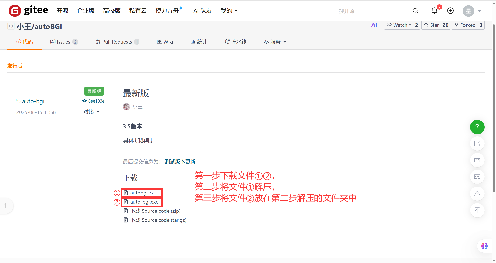

- **步骤二**：设置ABGI权限

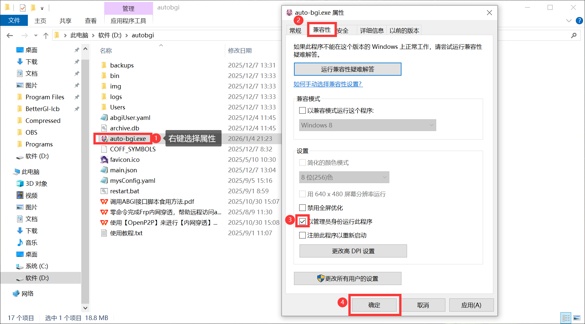

- **步骤三**：修改登录账号和密码，以及业主(标题)名字

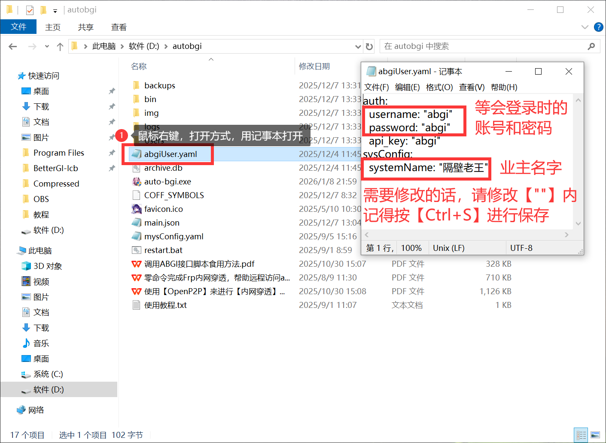

---

### 2. 启动服务
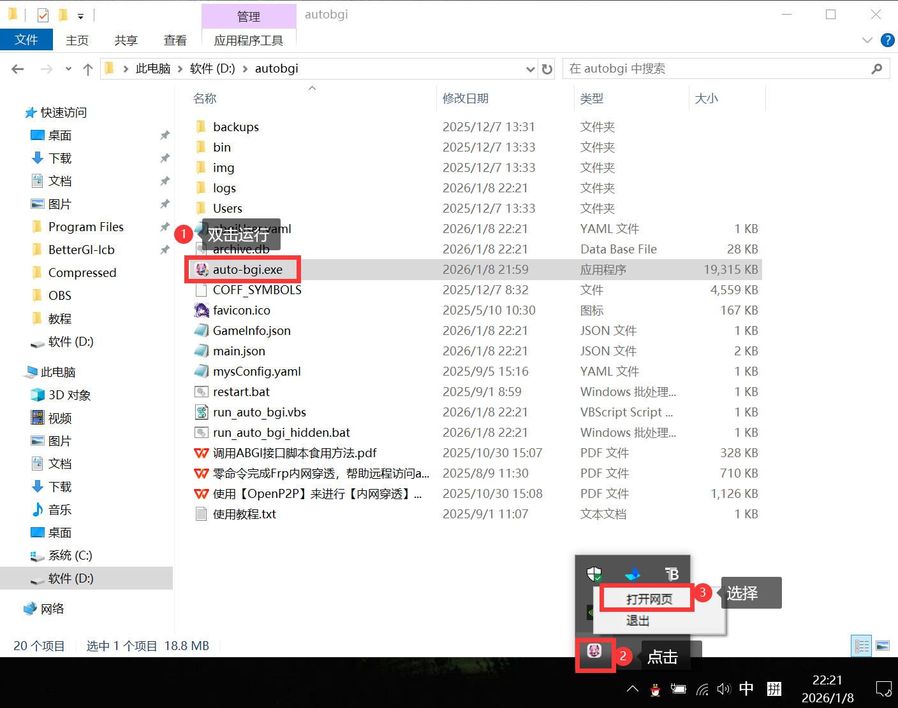


---

### 3. 初始配置

- **步骤一**：登录


- **步骤二**：进入后，找到【ABGI设置】


- **步骤三**：配置本地BGI路径并保存


---

## 功能说明
### 🔍实时监测

✅ **查看桌面**

查看运行着ABGI的电脑桌面

✅ **发送截图**

配置了企业微信通知或者其他软件通知，即可将运行着ABGI的电脑桌面发给企业微信或者其他通知软件

目前可以进行通知的软件有，企业微信，TG，飞书，OneBot

有这些通知软件的，需在【提瓦特指挥所】-【ABGI】-【消息通知】进行填写相关内容

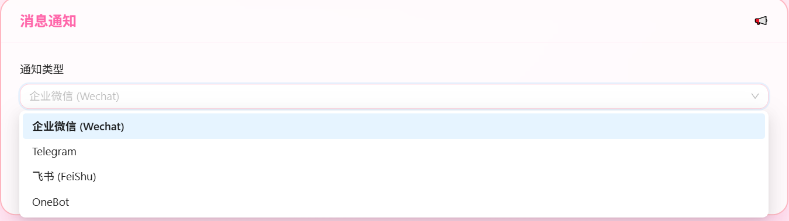

✅ **实时日志**

实时显示BGI运行时的持续输出的日志，支持多用户

✅ **ABGI日志查询**

对ABGI的日志进行了可视化

### 📊 数据分析

✅**查看狗粮日志**

该功能是与BGI中【AAA狗粮批发】JS脚本搭配使用的，对狗粮收益进行了可视化

如果你有联机的，联机收益会自动会自动相加，支持转换为统计图

✅**屑荧进村**

统计bgi交换或拾取数量超过10的材料，有相似度计算，只要不是ocr太离谱，程序都可以判断出材料真实名字是什么

✅**归档查询**

可以在ABGI的【配置组运行情况】里面，将每一个配置组进行归档，或者一条龙结束的时候，自动将今日所有的配置组运行情况进行归档，下次执行这个配置组就可以看见预计结束时间。配置组执行时间少于30s的，不进行自动归档，如果需要可以手动归档

✅**旅行者札记**

搭配BGI的JS脚本有【吃药统计】【背包材料统计】，摩拉收益需要你BGI的日志分析里填写了米游社的Cookie

可查看超过 **8000** 的材料

支持一键加入黑名单，一键删除黑名单

✅**配置组运行情况**

对BGI运行的配置组进行可视化分析，也可以点击查看详情，进行更加细致的分析

✅**采集管理**

搭配BGI的JS脚本【采集cd管理】使用，支持多用户，对采集数据进行记录，查看各采集材料的CD时间

### 🚀 自动化控制

✅**一条龙启动**

可直接执行BGI下的一条龙

✅**关闭BGI和原神**

关闭BGI和原神的运行

✅**调度圣坛**

可直接启动BGI的配置组，支持多配置组启动

✅**备份 USER 文件**

将BGI的User文件进行备份

✅**脚本屋**

订阅过的脚本，都会在这里显示，支持单个更新，批量更新

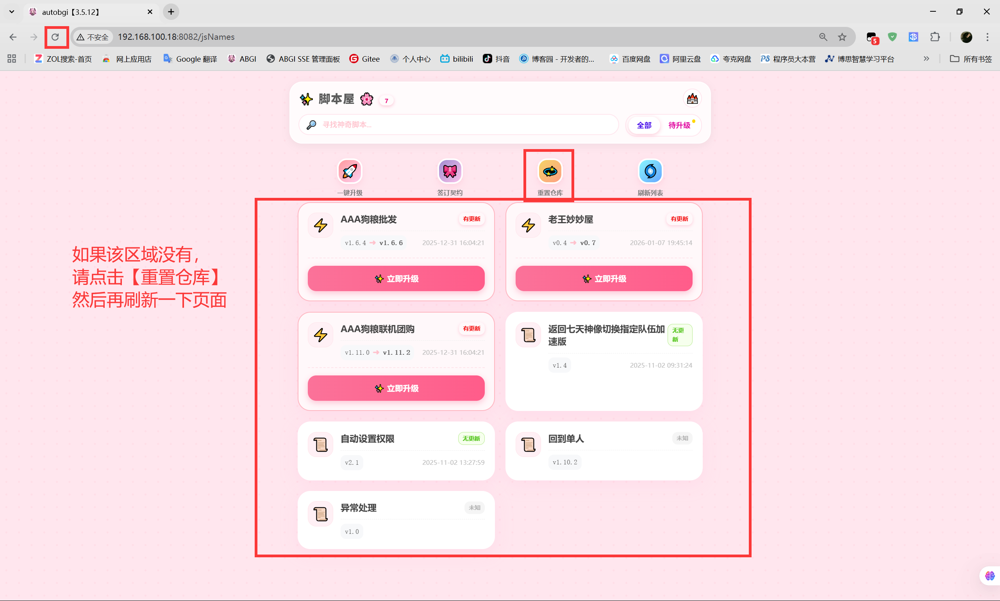

✅**地图追踪**（茶包版的未支持）

选择配置组，选择地图追踪文件夹

更新：

配置组有的会清理掉相关的地图追踪，再加入新的指定全部地图追踪进去，排到后面；

配置组没有的，直接加入进去。不点保存也可以，下次进来重新选择


✅**联机管理**

上线，模板图片生成，专属匹配房间，公共匹配房间.

如果是今天跑的狗粮是A线，则选择什么模式上线就是什么模式

如果是B线，强制调机 ，匹配池已经多达40多个人，每天13辆车，欢迎来联机


✅**ABGI定时任务**

| 任务类型               | 参数说明                                                     |
| ---------------------- | ------------------------------------------------------------ |
| 一条龙                 | 填写你的一条龙名称                                           |
| 配置组                 | 填写你的配置组名称，多个空格隔开                             |
| 米游社签到             | 不需要填写                                                   |
| 关闭原神和关闭bgi      |                                                              |
| 备份user               |                                                              |
| 定时关机               |                                                              |
| 狗粮联机上线           |                                                              |
| 狗粮联机调试上线       |                                                              |
| 联机下线               |                                                              |
| 电脑静音               |                                                              |
| 脚本自动更新           | 全部脚本更新                                                 |
| 指定脚本更新           | 脚本文件夹，多个空格隔开                                     |
| 启动bat脚本            | 填写你bat文件的文件路径                                      |
| 今日配置组执行情况通知 |                                                              |
| 开始obs录制            |                                                              |
| 结束obs录制            |                                                              |
| 键鼠操作               | *号隔开操作，只支持键鼠操作，<br/>鼠标格式：Mouse-x坐标-y坐标-左键还是右键-延迟毫秒<br/>键盘格式：Keyboard-按键名称-延迟毫秒<br/>案例：<br/>会在屏幕坐标1005,528的位置，单击右键，然后键盘输入：lwdsg。 |


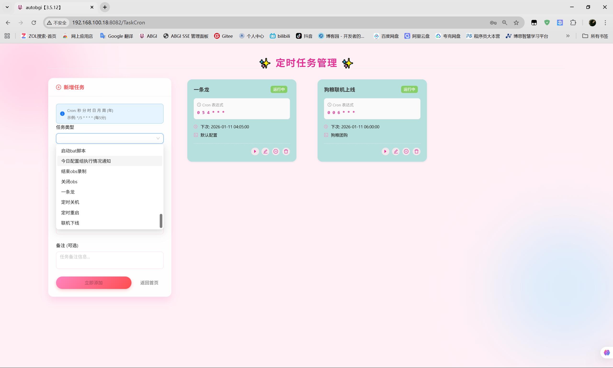

### 🧭 提瓦特指挥所

✅**录屏管理**

需要配合OBS(全称Open Broadcaster Software)使用

下载地址：[OBS](https://obsproject.com/zh-cn)，

简易教程如下：

开启后会启动obs录屏功能,请确保obs已经安装并开启远程控制,

OBS地址和密码填写正确，否则无法使用录屏功能。

请确保开起来websocket连接。

如果需要回放，请确保打开回放缓存功能。

abgi会根据关键字自动录制回放。

简单来说，开启回放缓存功能，开启websocket连接就行了


详细的图文教程：[配置OBS&&ABGI](./READMEOBS&&ABGI.md)

✅**仓库管理**

支持查看 `md` 和 `txt` 详情


✅**手动更新BGI**

上传BGI的压缩包，要求是解压出来就是文件夹

更新前会自动备份User文件夹和log文件夹，备份在根目录下Users，backups

✅**米游社签到**

需要去群里下载一个压缩包，解压放到根目录 ，配置好下面之后，去网页点击签到，如果有通知，签到成功，就可以去定时任务加任务

                             

需获取 **stoken-cookie**

如果签到还需要通知需要额外填写通知

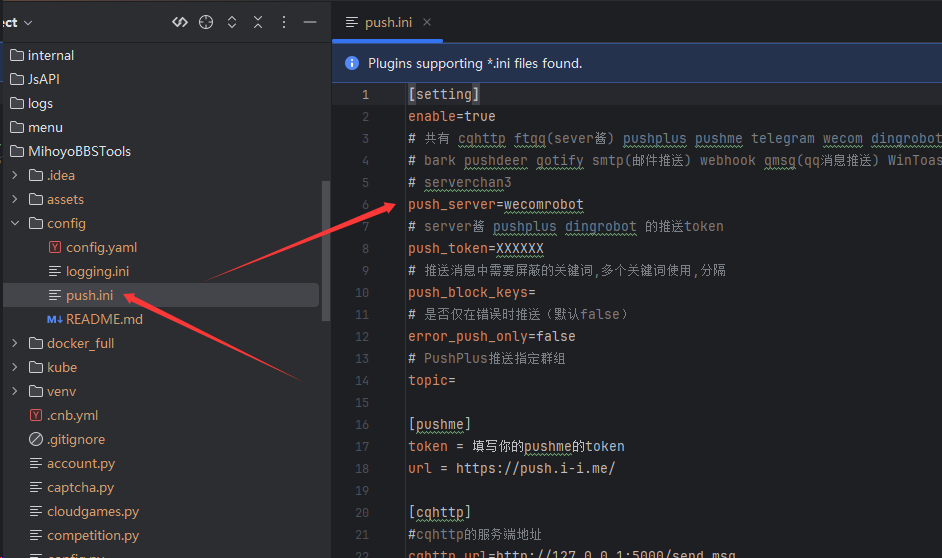

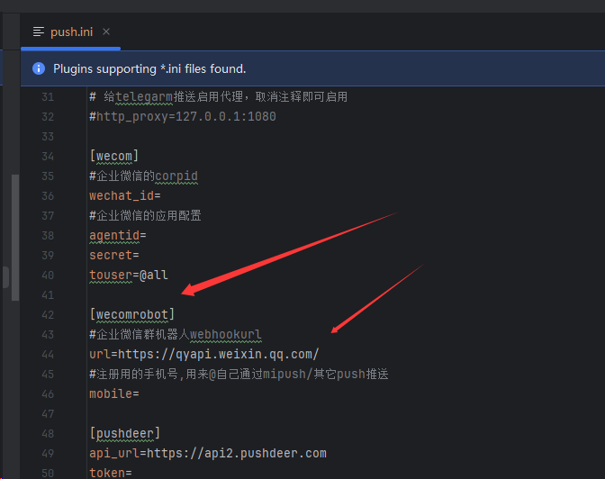

✅**检查更新**

可在线更新ABGI，以及茶包版

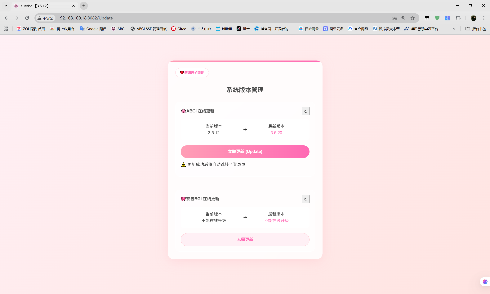

✅**BGI一条龙配置**

对公版BGI中一条龙里配置组进行打开和关闭操作

对茶包版BGI中一条龙里配置组进行排序、打开和关闭操作

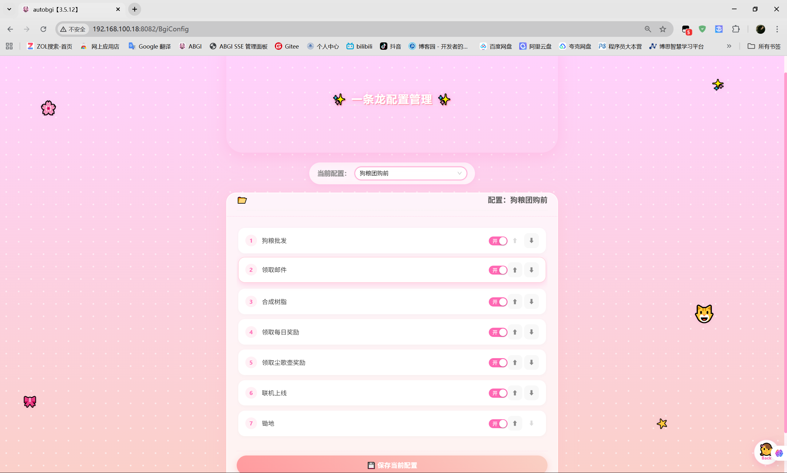

✅**ABGI设置**

- **基础设置**

  主要是填写BGI的本地路径

- **关注关键字**

  添加你需要关注的内容，BGI日志产生该内容就会发送截图给通知软件（前提你配置了通知）

- **功能开关**

  

- **1Remote 远程监控**

  搭配JS脚本【1Remote】脚本使用的，这个用于本地多用户的

- **录屏设置 (OBS)**

  请查看上面【提瓦特指挥所】-【录屏管理】

- **消息通知**

  填写你需要使用的通知软件

- **命令机器人**

  TG和飞书机器人指令，可以通过机器人远程控制ABGI，需要配置消息通知，机器人的配置是和通知配置一起的

| 命令               | 作用               |
| ------------------ | ------------------ |
| 启动一条龙xxx      | xxx是名字          |
| 启动配置组xxx yyyy | 多个配置组空格隔开 |
| 批量更新脚本       |                    |
| 联机上线           |                    |
| 联机下线           |                    |
| 情况               |                    |
| 截图               |                    |
| 开始录屏           |                    |
| 停止录屏           |                    |
| 关闭原神           |                    |
| 关闭bgi            |                    |
| 电脑关机           | 60秒之后           |
| 取消关机           |                    |

---

- **联机设置**

  这个是联机狗粮的，该内容请移步相关该JS脚本里写的群里了解

✅**退出登录**

回到登录界面

------


## 常见问题

### 1. 启动后打不开网页？
- 检查程序是否运行

- 确认防火墙放行端口（默认 8082）

- 更换端口，打开根目录下main.json文件，找到8082，改成你喜欢的，记得前面的   :  别删除了

  

---

### 2. 备份不成功？
- 确认路径是否正确
- 检查是否有权限访问目标文件夹

### 

---

## 命令行
在程序目录下执行：

```bash
auto-bgi.exe OneLong
```
作用：**软件启动，直接启动bgi运行一条龙**

```bash
auto-bgi.exe updateJs
```

作用：**软件启动，直接启动bgi并且更新脚本**

```
auto-bgi.exe online
```

作用：启动abgi，直接上线，调试模式

---

## 开发帮助
- **Go 版本**：`go1.23.2`
- **Node 版本**：`22.13.1`
- 构建脚本：`build.bat`

---

## 联系方式
- 频道：`@wjdsg`

**远程访问 autoBGI 的方法**：压缩包内附带教程文件（来自社区大佬）。花生壳也是一个不错的选择

##### qq群：215053644


## 


# 更新记录

