# autoBGI

## 📌 目录
- [介绍](#介绍)
- [软件架构](#软件架构)
- [安装教程](#安装教程)
- [配置说明](#配置说明)
  - [main.json 配置说明](#mainjson-配置说明)
- [功能说明](#功能说明)
- [常见问题](#常见问题)
- [命令](#命令)
- [开发帮助](#开发帮助)
- [联系方式](#联系方式)

---

## 介绍
**autoBGI** 是一个以 Go 为后端、Vue 为前端的 BGI(Genshin Impact) 自动化管理与日志分析工具。它整合了自动执行任务、背包统计、OBS 录屏/回放控制、AI 对话支持与飞书/TG 机器人通知等多种功能，目标是为 BGI 用户提供一体化的自动化运维与日志可视化工具。

界面基于 **Vue**，后端使用 **Go** 实现。

---

## 软件架构
- **后端**：Go 语言（go1.23.2）
- **前端**：Vue + Node.js（node 22.13.1）
- **构建脚本**：`build.bat`

---

## 安装教程

### 1. 下载程序
访问 [Gitee Releases](https://gitee.com/wangjian0327/auto-bgi/releases)，

下载最新版本的 **auto-bgi** 本体和最新版的exe文件。

下载完成后，解压即可本地，将 **auto-bgi.exe**文件放进目录。

---

### 2. 启动服务
解压完成后，直接双击运行程序，默认端口为 **8082**。  
在浏览器访问：  

```
http://<IP地址>:8082
```

📌 **注意**：  
- IP 地址可以在程序黑窗口中看到，如下图所示：

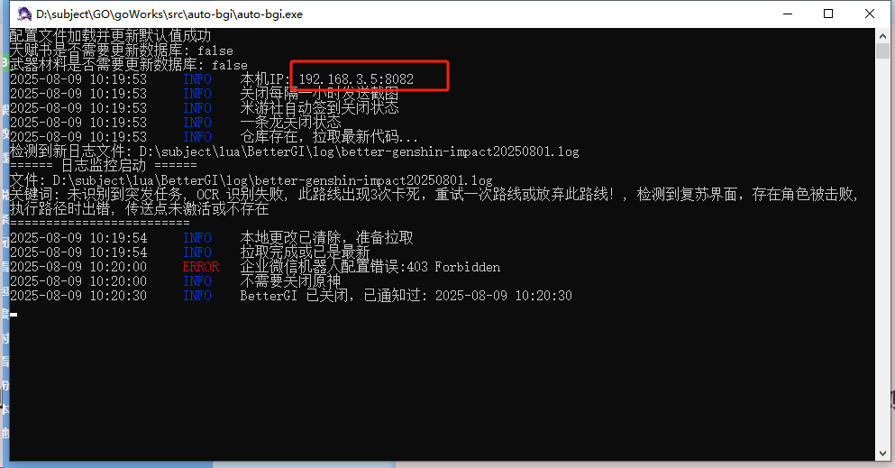

复制该 IP 地址并在浏览器打开。

也可以在托盘打开


---

### 3. 初始配置

先登录，账号和密码在根目录下，abgiUser.yaml，可以自行修改。

默认账号密码是：abgi

登录标题，默认隔壁老王，可以自行更改

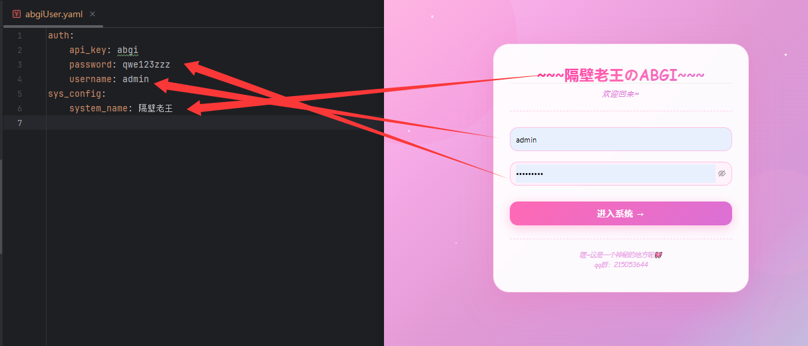


打开网页后，向下滚动，找到 **autoBGI 配置**。

- **第一步**：配置 BGI 安装路径（到 `exe` 文件夹即可）
- **第二步**：点击保存并重启程序
- **第三步**：继续配置其他选项

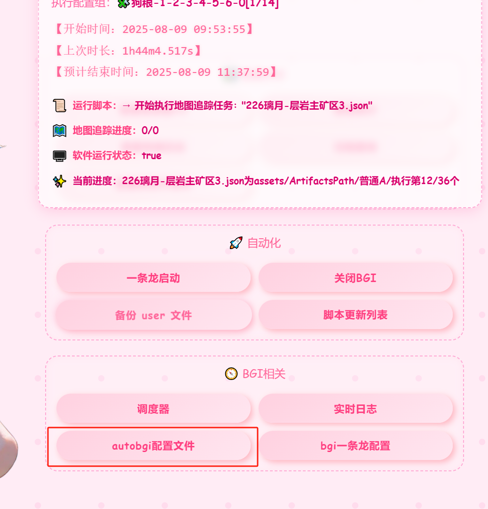

---

## 配置说明

### main.json 配置说明

关键字段配置：

```
post    启动端口
BetterGIAddress   bgi安装地址
```


---

## 功能说明
### ✅ 定时任务
- cron定时任务

  | 任务类型               | 参数说明（不需要填写，可以当个备注使用） |
  | ---------------------- | ---------------------------------------- |
  | 一条龙                 | 填写你的一条龙名称                       |
  | 配置组                 | 填写你的配置组名称，多个空格隔开         |
  | 米游社签到             | 不需要填写                               |
  | 关闭原神和关闭bgi      |                                          |
  | 备份user               |                                          |
  | 定时关机               |                                          |
  | 狗粮联机上线           |                                          |
  | 狗粮联机调试上线       |                                          |
  | 联机下线               |                                          |
  | 电脑静音               |                                          |
  | 脚本自动更新           | 全部脚本更新                             |
  | 指定脚本更新           | 脚本文件夹，多个空格隔开                 |
  | 启动bat脚本            | 填写你bat文件的文件路径                  |
  | 今日配置组执行情况通知 |                                          |
  | 开始obs录制            |                                          |
  | 结束obs录制            |                                          |
  
  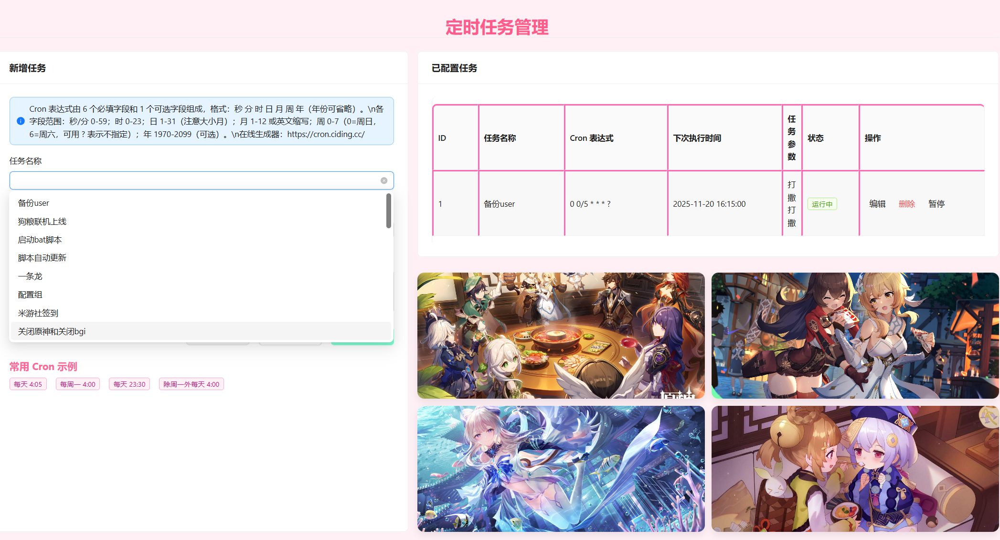

### ✅ 实时日志
- 网页实时显示 BGI 日志，支持多用户

  

### ✅ 背包统计
- 基于 **吉吉猫** 和 **摩拉 OCR** 脚本和**原石统计脚本**脚本（三个脚本）

- 可查看超过 **8000** 的材料

  

- 支持一键加入黑名单，一键删除黑名单

  

将所有统计转成统计图

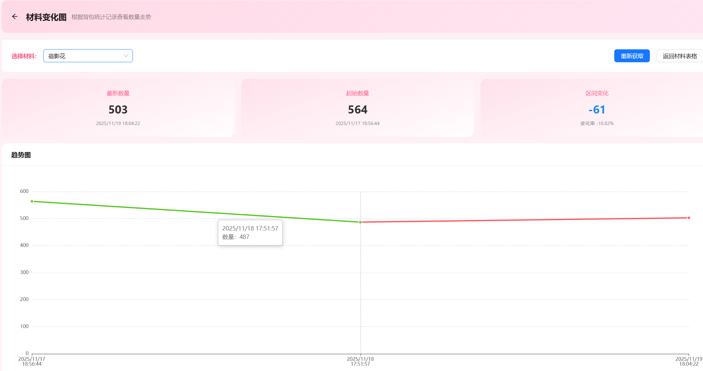

### ✅ **收获超过10的材料**

统计bgi交换或拾取数量超过10的材料，有相似度计算，只要不是ocr太离谱，程序都可以判断出材料真实名字是什么


### ✅ 调度器

  可以直接启动配置组（45.2版本以上），多个启动


### ✅ 脚本更新列表
- 订阅过的脚本，都会在这里显示，支持单个更新，批量更新，一条龙开始更新，定时任务更新。

  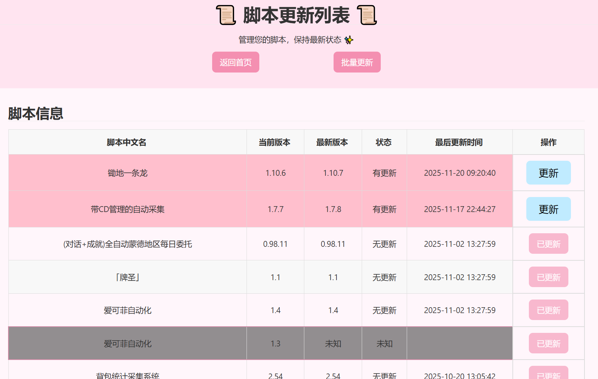

  

### ✅仓库提交记录（三天）

支持查看 `md` 和 `txt` 详情

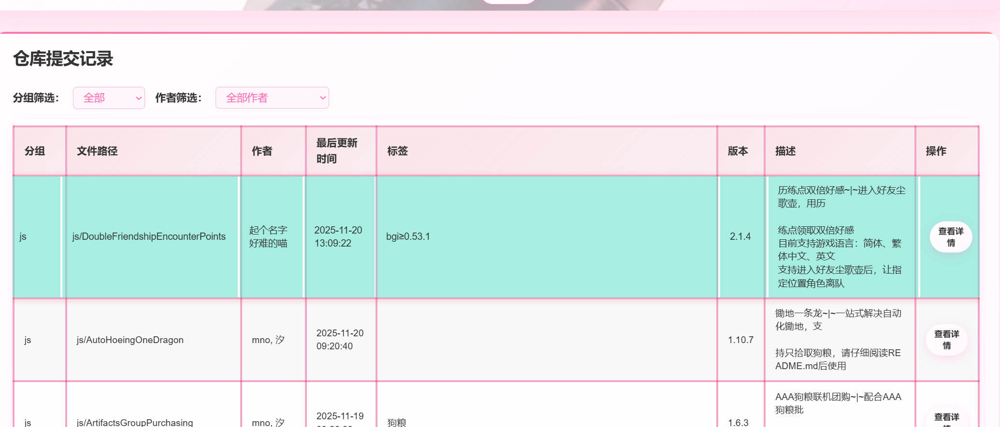

### ✅归档记录

可以在配置组运行情况里面，将每一个配置组进行归档，或者一条龙结束的时候，自动将今日所有的配置组运行情况进行归档，下次执行这个配置组就可以看见预计结束时间。配置组执行时间少于30s的，不进行自动归档，如果需要可以手动归档

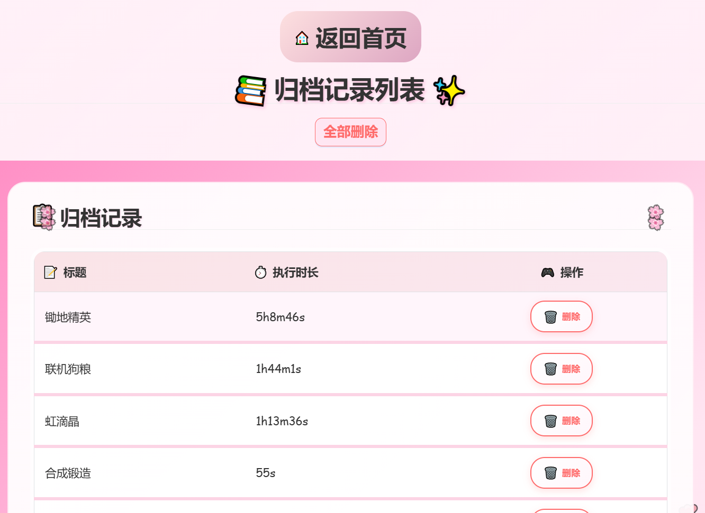

### ✅ 米游社签到

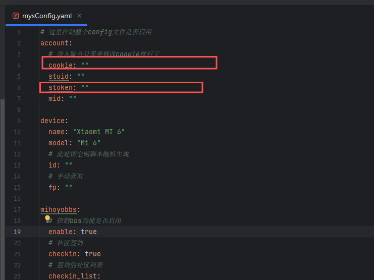

- 需获取 **stoken-cookie**，加群，需要搭配一个压缩包（https://github.com/bcmdy/MihoyoBBSTools）

- 只需要填如图两个值就行

  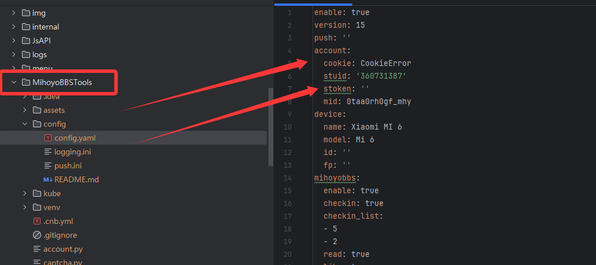

### ✅地图追踪更新功能（茶包版本的不行）

功能说明：

选择配置组，选择地图追踪文件夹。

更新：

配置组有的会清理掉相关的地图追踪，再加入新的指定全部地图追踪进去，排到后面；

配置组没有的，直接加入进去。不点保存也可以，下次进来重新选择

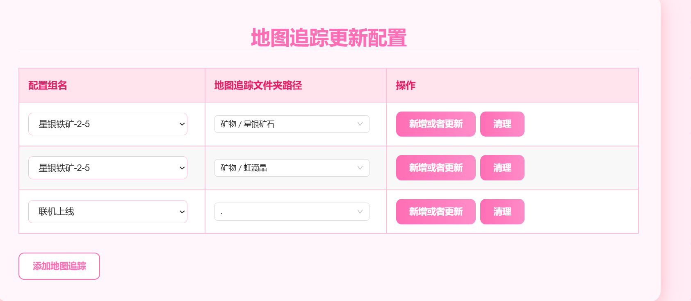

### ✅录屏功能


需要配合obs使用,下载地址：[OBS](https://obsproject.com/zh-cn)，

简易教程如下：

开启后会启动obs录屏功能,请确保obs已经安装并开启远程控制,

obs地址和密码填写正确，否则无法使用录屏功能。

请确保开起来websocket连接。

如果需要回放，请确保打开回放缓存功能。

abgi会根据关键字自动录制回放。

简单来说，开启回放缓存功能，开启websocket连接就行了

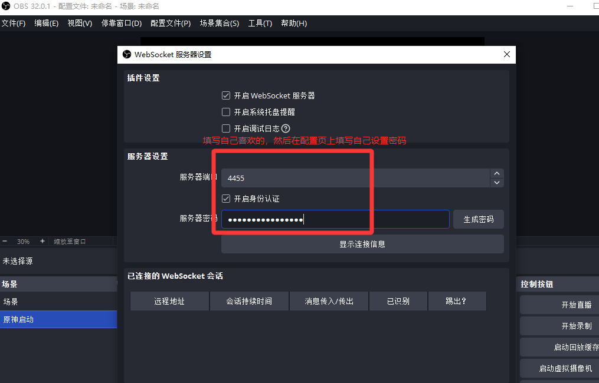

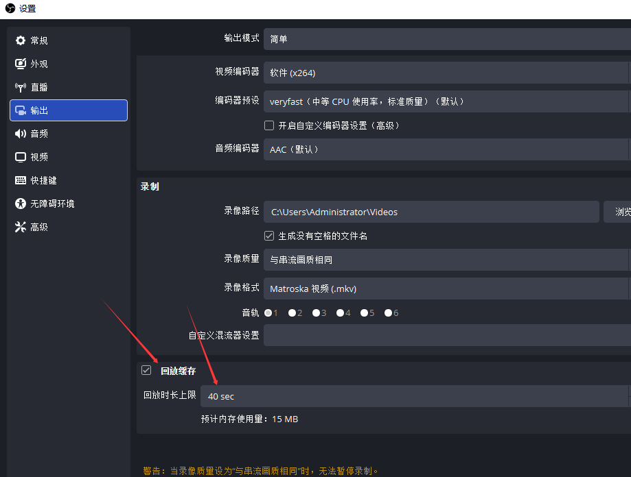


详细的图文教程：[配置OBS&&ABGI](./READMEOBS&&ABGI.md)

### ✅狗粮联机功能

联机功能：上线，模板图片生成，专属匹配房间，公共匹配房间.

如果是今天跑的狗粮是A线，则选择什么模式上线就是什么模式

如果是B线，强制调机 ，匹配池已经多达40多个人，每天13辆车，欢迎来联机


### ✅CD管理自动采集

配合CD管理自动采集脚本使用

可以看cd时间，支持一键加入背包统计，支持一键更新

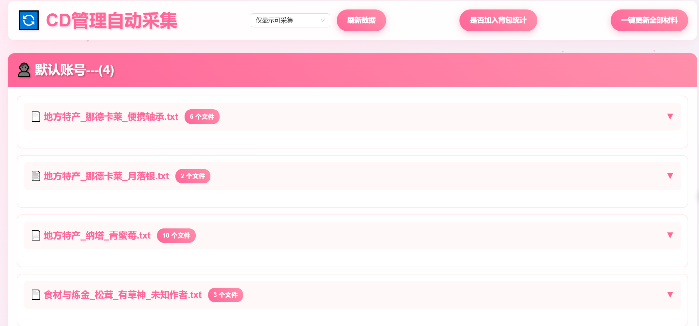

### ✅机器人指令

TG和飞书机器人指令，可以通过机器人远程控制abgi，需要在abgi配置里面开启，机器人的配置是和通知配置一起的，你需要去通知配置里面配置好，才能使用。

| 命令               | 作用               |
| ------------------ | ------------------ |
| 启动一条龙xxx      | xxx是名字          |
| 启动配置组xxx yyyy | 多个配置组空格隔开 |
| 批量更新脚本       |                    |
| 联机上线           |                    |
| 联机下线           |                    |
| 情况               |                    |
| 截图               |                    |
| 开始录屏           |                    |
| 停止录屏           |                    |
| 关闭原神           |                    |
| 关闭bgi            |                    |
| 电脑关机           | 60秒之后           |
| 取消关机           |                    |

### ✅查看狗粮日志

如果你有联机的，联机收益会自动会自动相加，支持转换为统计图

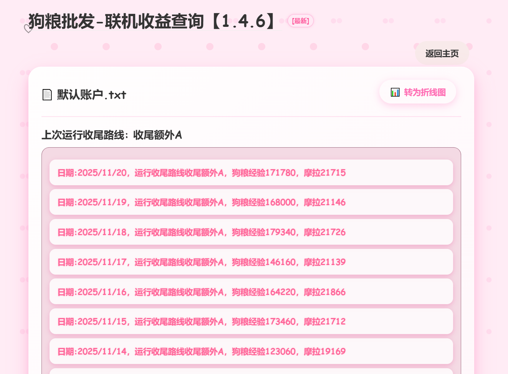

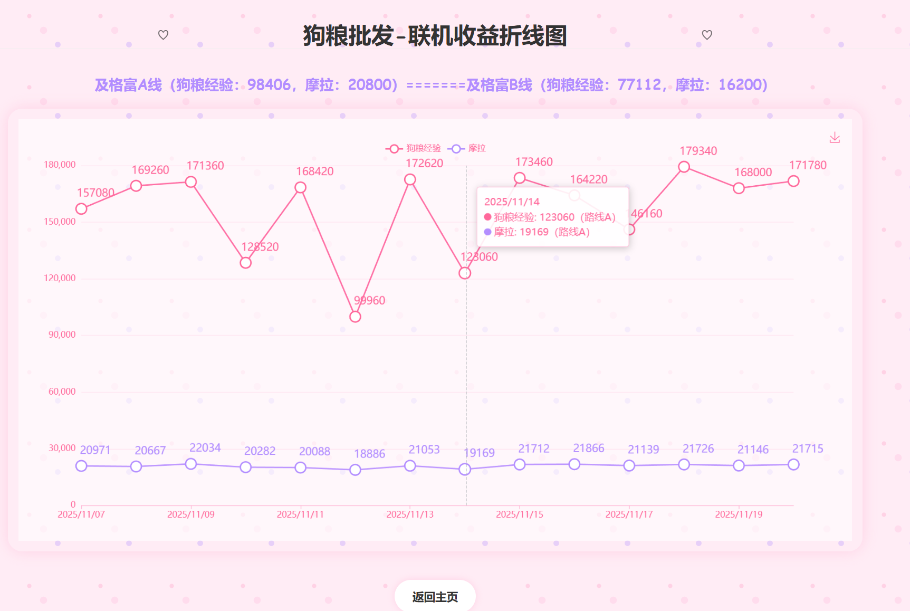

### ✅配置组运行情况

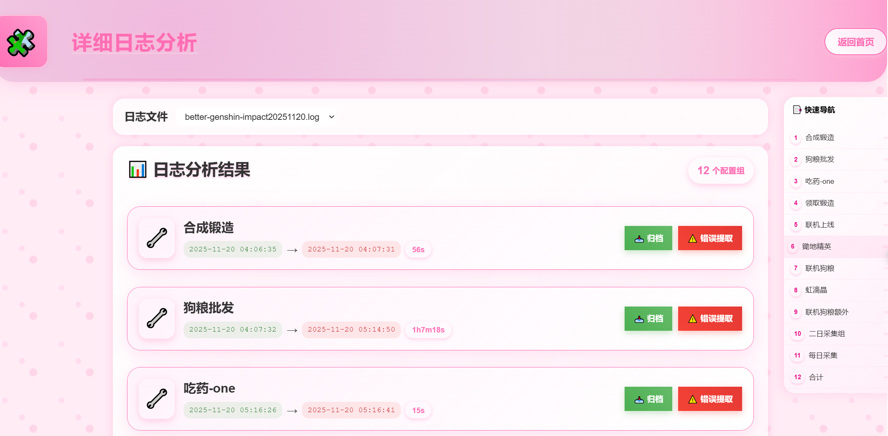

---

### ✅一键更新bgi（上传bgi的压缩包，解压出来就是文件夹，不要又包了一层压缩包）

更新前会自动备份User文件夹和log文件夹，备份在根目录下Users，backups

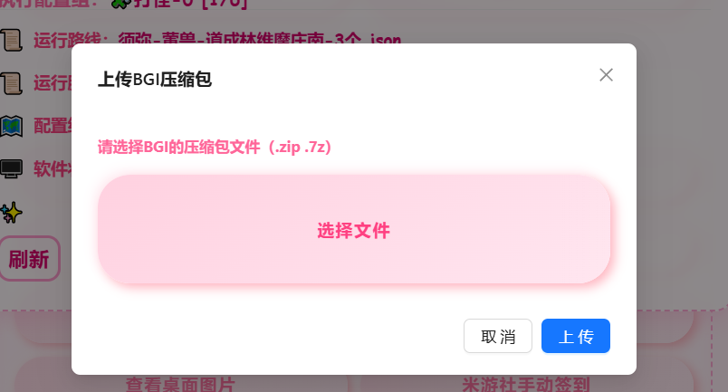

## 常见问题

### 1. 启动后打不开网页？
- 检查程序是否运行
- 确认防火墙放行端口（默认 8082）
- 更换端口，打开根目录下main.json文件，找到8082，改成你喜欢的，记得前面的   :  别删除了

---

### 2. 备份不成功？
- 确认路径是否正确
- 检查是否有权限访问目标文件夹

### 

---

## 命令行
在程序目录下执行：

```bash
auto-bgi.exe OneLong
```
作用：**软件启动，直接启动bgi运行一条龙**

```bash
auto-bgi.exe updateJs
```

作用：**软件启动，直接启动bgi并且更新脚本**

```
auto-bgi.exe online
```

作用：启动abgi，直接上线，调试模式

---

## 开发帮助
- **Go 版本**：`go1.23.2`
- **Node 版本**：`22.13.1`
- 构建脚本：`build.bat`

---

## 联系方式
- 频道：`@wjdsg`

**远程访问 autoBGI 的方法**：压缩包内附带教程文件（来自社区大佬）。花生壳也是一个不错的选择

##### qq群：215053644

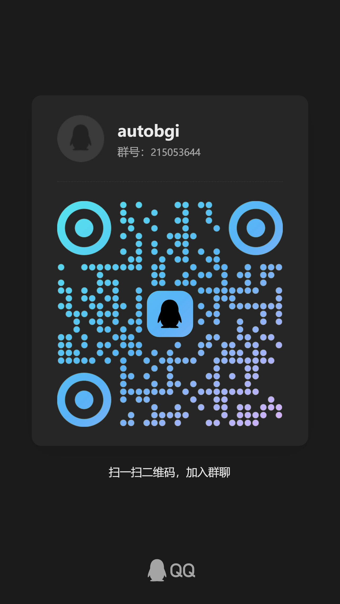


# 更新记录

#### 3.3版本

时间：2025-12-06

1、新增托盘，右键有一键打开网址

2、新增多个定时任务，优化问题

3、脚本列表优化

4、日志通知新增时间

5、新增登录功能，账号密码默认：abgi

6、新增bgi一键更新功能


