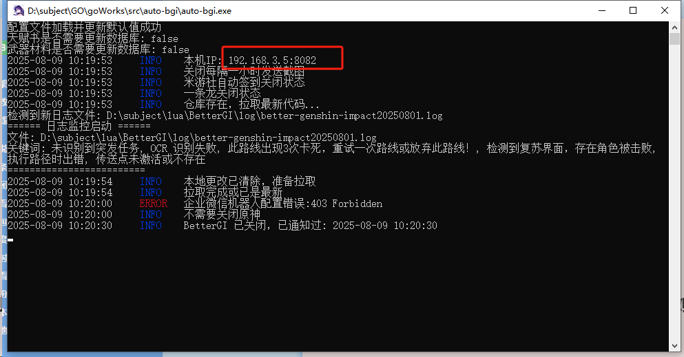

# autoBGI

## 📌 目录
- [介绍](#介绍)
- [软件架构](#软件架构)
- [安装教程](#安装教程)
- [配置说明](#配置说明)
  - [main.json 配置说明](#mainjson-配置说明)
- [功能说明](#功能说明)
- [常见问题](#常见问题)
- [命令](#命令)
- [开发帮助](#开发帮助)
- [联系方式](#联系方式)

---

## 介绍
**autoBGI** 是一款针对 **BGI 的自动化管理与日志分析工具**，集成了以下核心功能：
- 一条龙定时执行
- 背包统计、日志分析
- 自动备份、脚本管理
- 多种通知方式（企业微信 / TG）
- 米游社签到
- 实时日志查看

界面基于 **Vue**，后端使用 **Go** 实现，支持多用户访问。

---

## 软件架构
- **后端**：Go 语言（go1.23.2）
- **前端**：Vue + Node.js（node 22.13.1）
- **构建脚本**：`build.bat`

---

## 安装教程

### 1. 下载程序
访问 [Gitee Releases](https://gitee.com/wangjian0327/auto-bgi/releases)，

下载最新版本的 **auto-bgi** 本体和最新版的exe文件。

下载完成后，解压即可本地，将exe文件放进目录。

---

### 2. 启动服务
解压完成后，直接双击运行程序，默认端口为 **8082**。  
在浏览器访问：  
```
http://<IP地址>:8082
```

📌 **注意**：  
- IP 地址可以在程序黑窗口中看到，如下图所示：



复制该 IP 地址并在浏览器打开。

---

### 3. 初始配置
打开网页后，向下滚动，找到 **autoBGI 配置**。

- **第一步**：配置 BGI 安装路径（到 `exe` 文件夹即可）
- **第二步**：点击保存并重启程序
- **第三步**：继续配置其他选项


---

## 配置说明

### main.json 配置说明

配置文件路径：`auto-bgi/main.json`

以下是各字段说明：

| 配置项                  | 说明                                                                 |
|-------------------------|----------------------------------------------------------------------|
| **OneLong**            | 一条龙定时配置                                                     |
| ├─ isStartTimeLong     | `true` 开启 / `false` 关闭                                         |
| ├─ OneLongHour         | 启动小时（0-23）                                                  |
| ├─ OneLongMinute       | 启动分钟（1-59）                                                  |
| **BetterGIAddress**    | BGI 安装路径（到 `exe` 文件夹）                                    |
| **content**            | BGI 关闭时发送的通知信息                                           |
| **ConfigNames**        | 一条龙配置单，七个对应七天，从周一开始                            |
| **BagStatistics**      | 背包统计脚本，需要关注的材料，逗号分隔                             |
| **post**               | 默认 `8082`，可自定义端口                                          |

---

#### MySign（米游社签到）
```json
"MySign": {
  "isMysSignIn": true,
  "Time": "0,2"
}
```
- `isMysSignIn`：是否开启签到
- `Time`：签到时间（小时,分钟）

---

#### Control（控制配置）
- `IsCloseYuanShen`：关闭 BGI 时是否关闭原神和启动器
- `SendWeChatImage`：是否每小时发送桌面截图

---

#### LogKeywords（日志关键字）
```json
[
  "未识别到突发任务",
  "OCR 识别失败",
  "此路线出现3次卡死",
  "重试一次路线或放弃此路线！",
  "检测到复苏界面",
  "存在角色被击败",
  "执行路径时出错",
  "传送点未激活或不存在"
]
```

---

#### ScreenRecord（录屏）
```json
"ScreenRecord": {
  "IsRecord": true,
  "ScriptGroupName": "配置组名称"
}
```

---

#### Notice（通知）
- 支持 **TG**、**企业微信**
- **TG 配置**：
```json
"TGNotice": {
  "TGToken": "your-token",
  "ChatID": "your-chat-id",
  "Proxy": "代理地址"
}
```

---

## 功能说明
### ✅ 一条龙启动
- 支持指定配置单，并根据命名规则自动控制执行时间
- 示例：`狗粮-0-1` 表示该配置组只会在周日、周一执行

### ✅ 实时日志
- 网页实时显示 BGI 日志，支持多用户

### ✅ 背包统计
- 基于 **吉吉猫** 和 **摩拉 OCR** 脚本
- 可查看超过 **8000** 的材料

### ✅ 自动备份
- 默认备份 `User` 文件夹，每三天自动执行
- 可指定额外文件或文件夹，压缩打包后存储于 `Users` 目录

### ✅ 脚本更新与仓库提交记录
- 自动拉取订阅脚本列表，显示最近 **10 条提交记录**
- 支持查看 `md` 和 `txt` 详情

### ✅ 米游社签到
- 需获取 **stoken-cookie**，教程：[点击查看](https://hut.ao/zh/advanced/get-stoken-cookie-from-the-third-party.html)

---

## 常见问题

### 1. 启动后打不开网页？
- 检查程序是否运行
- 确认防火墙放行端口（默认 8082）
- 使用程序黑窗口显示的 IP，而不是 `127.0.0.1`

---

### 2. 备份不成功？
- 确认路径是否正确
- 检查是否有权限访问目标文件夹

---

## 命令
在程序目录下执行：

```bash
auto-bgi.exe oneLong
```
作用：**启动一条龙模式**

---

## 开发帮助
- **Go 版本**：`go1.23.2`
- **Node 版本**：`22.13.1`
- 构建脚本：`build.bat`

---

## 联系方式
- QQ：`485595674`
- 频道：`@wjdsg`

**远程访问 autoBGI 的方法**：压缩包内附带教程文件（来自社区大佬）。

---
