# 配置OBS搭配ABGI的图文教程

## 配置OBS

### 下载地址：OBS

下载安装好，就可以进行图文一步走系列，完全为图文教学

### 初始化

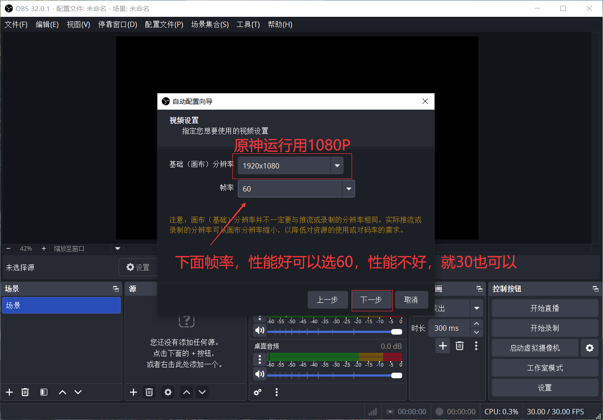
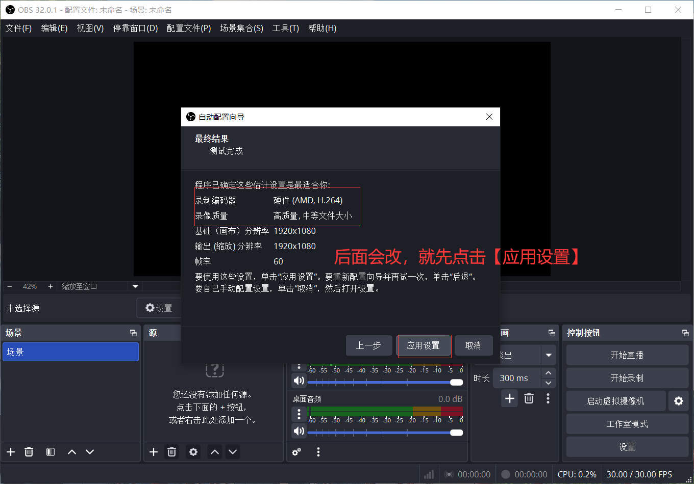

### 设置录制的窗口

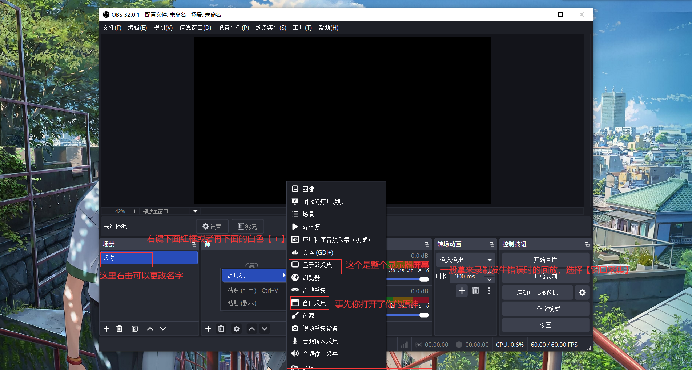
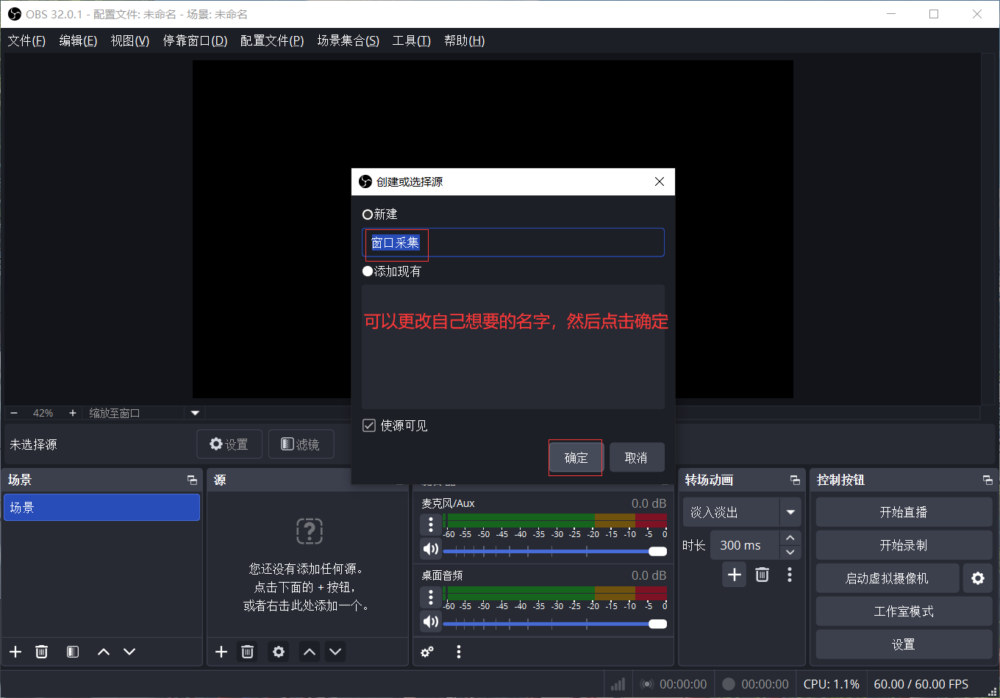
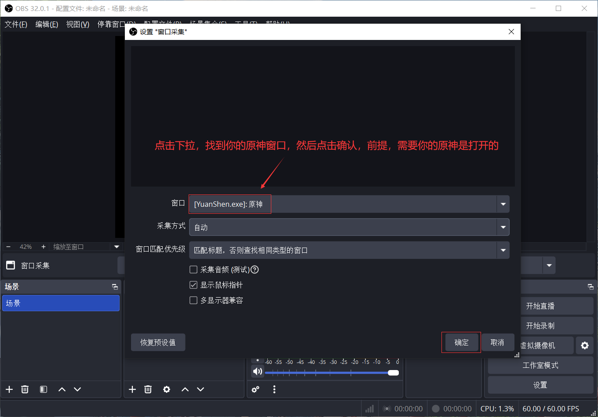

### 打开设置，找到输出，修改相关内容，点击确定

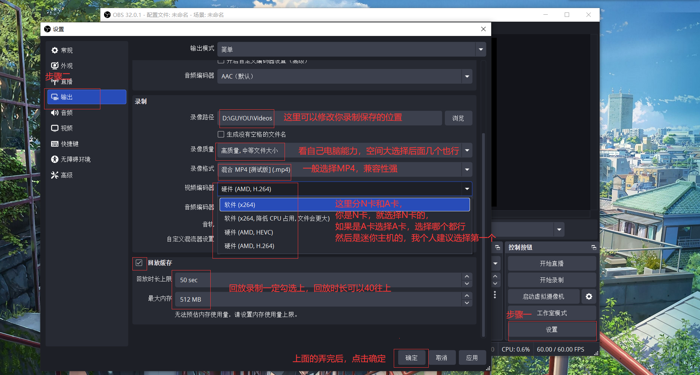

### 点击【启动回放缓存】并保存一个视频

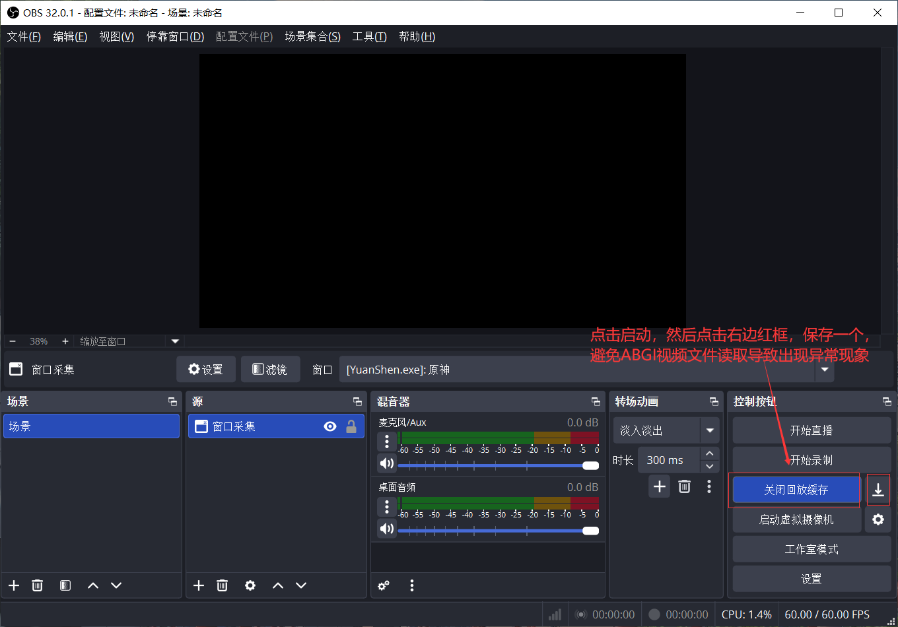

### 开启WebSocket服务器并复制相关信息

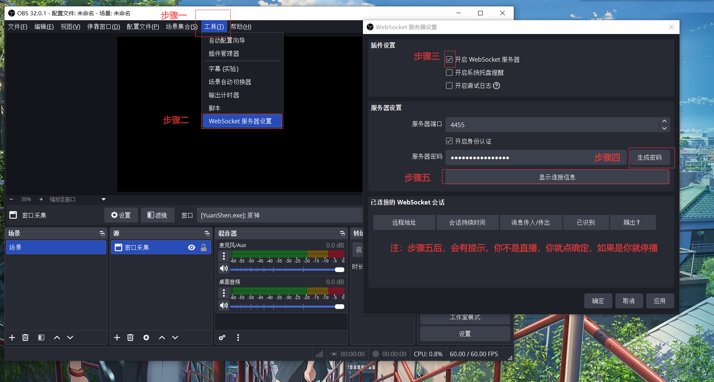
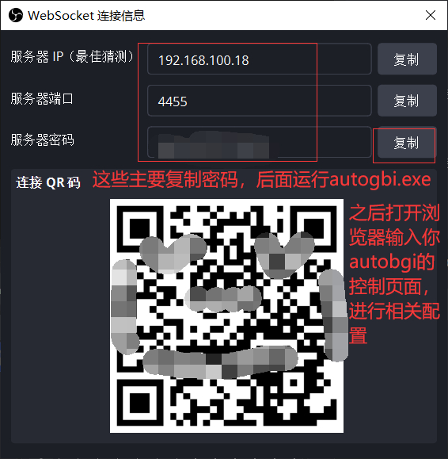

### 配置ABGI

请运行你autobgi程序，然后在浏览器输入你管理页面

找到配置文件，进入并填写相关内容
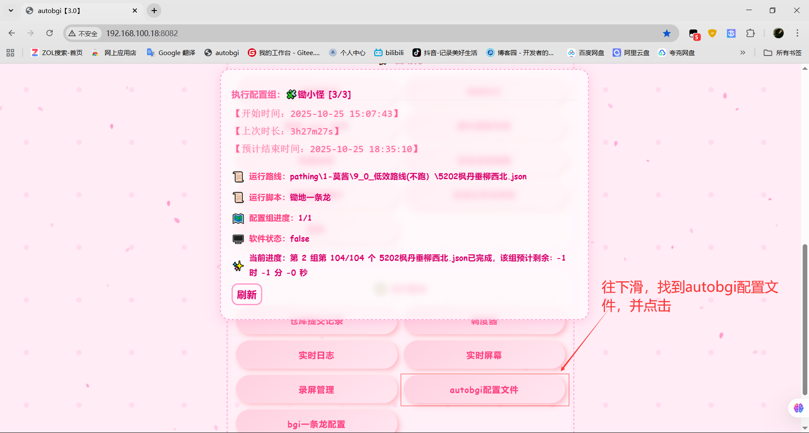
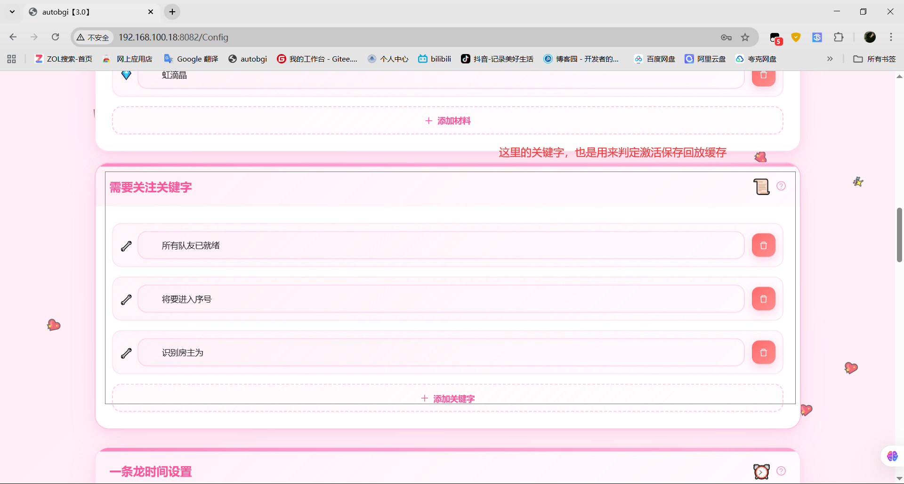
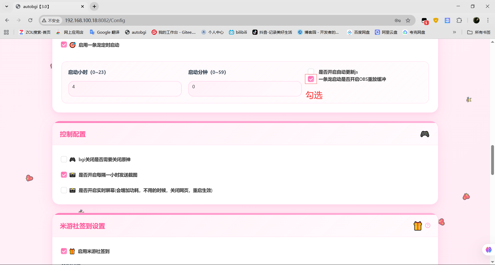

### 注意 记得填写好后，在下面点击保存

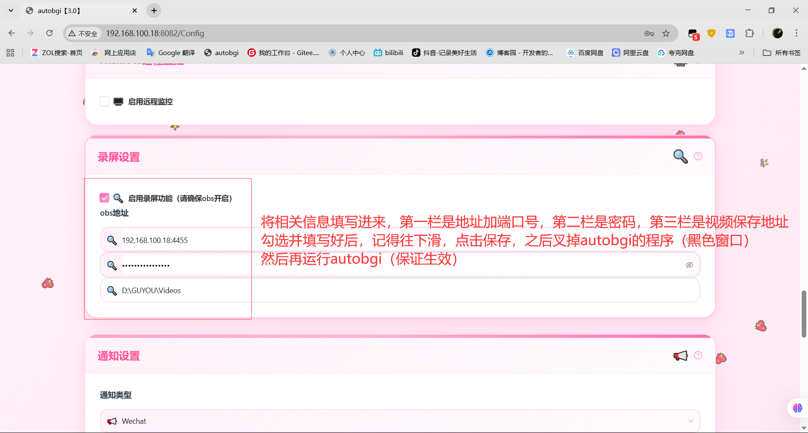

### 运行autobgi,浏览器打开管理页面，进入录屏管理

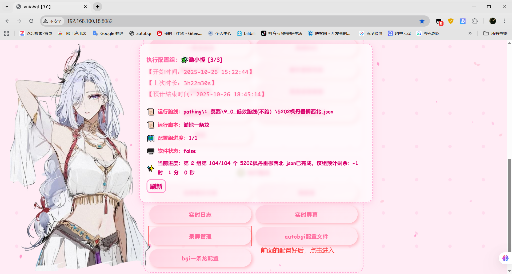
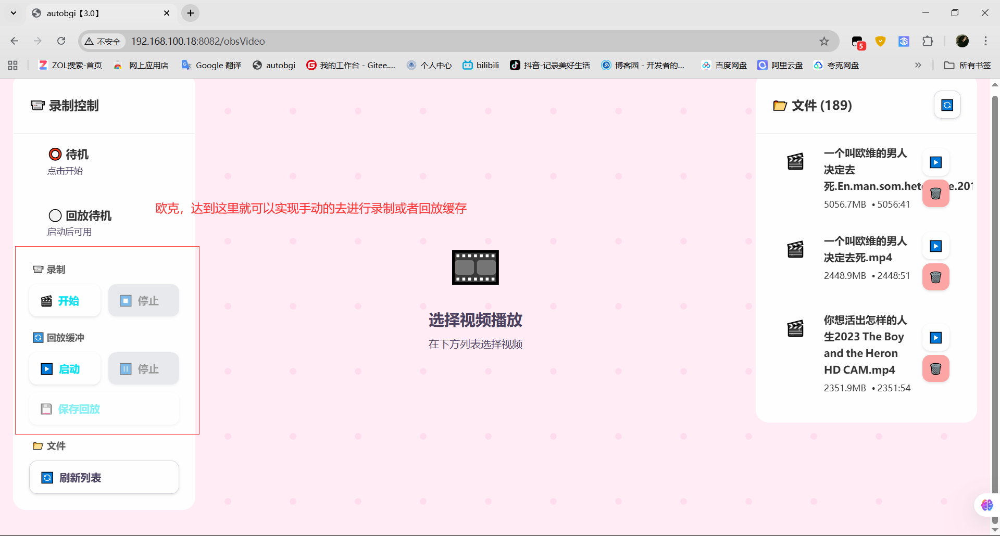